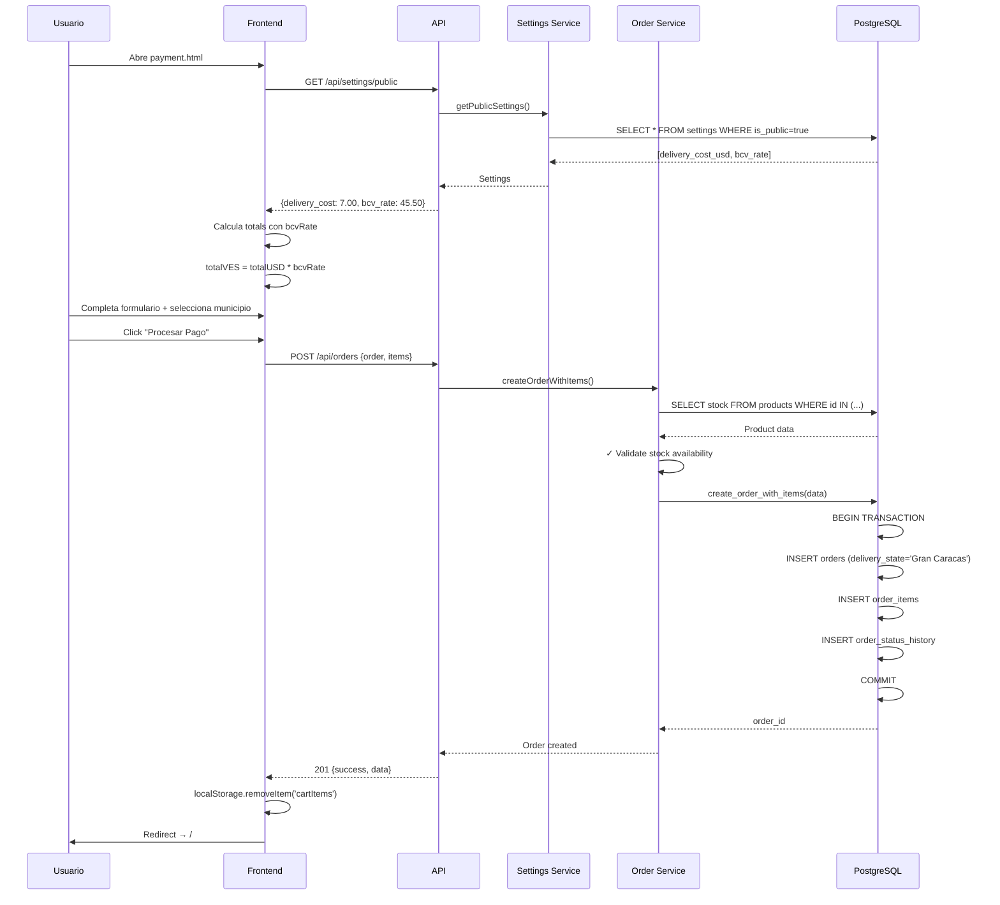

# 🔧 Payment Workflow - Correcciones Implementadas

## 📋 Resumen de Cambios

Se han implementado todas las correcciones solicitadas para el workflow de pago de FloresYa, adaptándolo específicamente para operaciones en **Gran Caracas** con integración completa de settings y validaciones.

---

## ✅ Cambios Implementados

### 1. **Delivery Cost desde Settings** ✓

**Problema:** Costo hardcodeado a $5.00  
**Solución:** Costo dinámico desde tabla `settings` con fallback a $7.00

**Archivos modificados:**

- [`api/services/paymentService.js`](api/services/paymentService.js:110) - Nueva función `getDeliveryCost()`
- [`public/pages/payment.js`](public/pages/payment.js:10) - Carga dinámica del costo
- [`scripts/seed-payment-settings.js`](scripts/seed-payment-settings.js:1) - Script de seed

**Implementación:**

```javascript
// Backend
export async function getDeliveryCost() {
  const { data } = await supabase
    .from('settings')
    .select('value')
    .eq('key', 'delivery_cost_usd')
    .single()

  return data ? parseFloat(data.value) : 7.0 // Fallback
}

// Frontend
async function loadSettings() {
  const response = await fetch('/api/settings/public')
  const settings = await response.json()
  deliveryCost = settings.find(s => s.key === 'delivery_cost_usd')?.value || 7.0
}
```

---

### 2. **Campo Estado Eliminado → Gran Caracas** ✓

**Problema:** Campo Estado genérico para toda Venezuela  
**Solución:** Fijo a "Gran Caracas", solo municipios

**Archivos modificados:**

- [`public/pages/payment.html`](public/pages/payment.html:169) - Dropdown de estados eliminado
- [`public/pages/payment.js`](public/pages/payment.js:477) - `delivery_state: 'Gran Caracas'` fijo
- [`api/middleware/schemas.js`](api/middleware/schemas.js:177) - `delivery_state` ahora opcional

**Antes:**

```html
<select id="delivery-state">
  <option>Distrito Capital</option>
  <option>Miranda</option>
  <!-- 25+ estados -->
</select>
```

**Después:**

```javascript
delivery_state: 'Gran Caracas' // Fijo en backend
```

---

### 3. **City → Municipio (Gran Caracas)** ✓

**Problema:** Campo "Ciudad" genérico  
**Solución:** Dropdown con municipios específicos de Gran Caracas

**Archivos modificados:**

- [`public/pages/payment.html`](public/pages/payment.html:172) - Nuevo dropdown
- [`public/pages/payment.js`](public/pages/payment.js:348) - Campo renombrado a `deliveryMunicipio`

**Municipios disponibles:**

- Libertador (Caracas)
- Baruta
- Chacao
- El Hatillo
- Sucre (Petare)
- Carrizal
- Guaicaipuro (Los Teques)
- Cristóbal Rojas (Charallave)
- Zamora (Guatire)
- Plaza (Guarenas)

```html
<select id="delivery-municipio" required>
  <option value="Libertador">Libertador (Caracas)</option>
  <option value="Baruta">Baruta</option>
  <option value="Chacao">Chacao</option>
  <!-- ... -->
</select>
```

---

### 4. **Cálculo VES desde Tasa BCV** ✓

**Problema:** Tasa hardcodeada a 40.00  
**Solución:** Tasa dinámica desde `settings.bcv_rate`

**Archivos modificados:**

- [`api/services/paymentService.js`](api/services/paymentService.js:148) - Nueva función `getBCVRate()`
- [`public/pages/payment.js`](public/pages/payment.js:11) - Carga dinámica de tasa
- [`scripts/seed-payment-settings.js`](scripts/seed-payment-settings.js:13) - Seed de tasa BCV

**Implementación:**

```javascript
// Backend
export async function getBCVRate() {
  const { data } = await supabase.from('settings').select('value').eq('key', 'bcv_rate').single()

  return data ? parseFloat(data.value) : 40.0 // Fallback
}

// Frontend - Cálculo automático
const totalUSD = subtotal + shippingCost
const totalVES = totalUSD * bcvRate // Tasa dinámica

const orderPayload = {
  order: {
    total_amount_usd: totalUSD,
    total_amount_ves: totalVES,
    currency_rate: bcvRate
  },
  items: cartItems.map(item => ({
    unit_price_ves: item.price_usd * bcvRate, // ✓ Calculado
    subtotal_ves: item.price_usd * item.quantity * bcvRate // ✓ Calculado
  }))
}
```

---

### 5. **Tabla Payments (Múltiples Pagos)** ✓

**Problema:** No se persistían los métodos de pago, solo en `order.notes`  
**Solución:** Función `confirmPayment()` que crea registros en tabla `payments`

**Archivos modificados:**

- [`api/services/paymentService.js`](api/services/paymentService.js:186) - `confirmPayment()` y `getOrderPayments()`

**Estructura tabla `payments`:**

```sql
CREATE TABLE payments (
  id SERIAL PRIMARY KEY,
  order_id INTEGER REFERENCES orders(id),
  payment_method_id INTEGER REFERENCES payment_methods(id),
  payment_method_name TEXT,
  amount_usd DECIMAL(10,2),
  amount_ves DECIMAL(10,2),
  currency_rate DECIMAL(10,4),
  status TEXT, -- pending, completed, failed, refunded
  reference_number TEXT,
  payment_details JSONB,
  receipt_image_url TEXT,
  payment_date TIMESTAMP,
  confirmed_date TIMESTAMP,
  created_at TIMESTAMP,
  updated_at TIMESTAMP
);
```

**Uso:**

```javascript
// Una orden puede tener múltiples pagos
POST /api/payments/:orderId/confirm
{
  "payment_method": "zelle",
  "reference_number": "FY-123456",
  "payment_details": {
    "email": "payments@floresya.com"
  }
}

// Más tarde, otro pago
POST /api/payments/:orderId/confirm
{
  "payment_method": "bank_transfer",
  "reference_number": "TRF-789012",
  "payment_details": {
    "bank": "Banco Mercantil",
    "account": "0105-..."
  }
}
```

---

### 6. **Validación de Stock** ✓

**Problema:** No se validaba disponibilidad antes de crear orden  
**Solución:** Check de stock en `createOrderWithItems()`

**Archivos modificados:**

- [`api/services/orderService.js`](api/services/orderService.js:251) - Validación pre-insert

**Implementación:**

```javascript
// Antes de crear orden, validar cada producto
for (const item of orderItems) {
  const { data: product } = await supabase
    .from('products')
    .select('id, name, stock, active')
    .eq('id', item.product_id)
    .single()

  if (!product) {
    throw new NotFoundError('Product', item.product_id)
  }

  if (!product.active) {
    throw new ValidationError('Product is not active', {
      productId: item.product_id,
      productName: product.name
    })
  }

  if (product.stock < item.quantity) {
    throw new ValidationError('Insufficient stock', {
      productId: item.product_id,
      productName: product.name,
      requested: item.quantity,
      available: product.stock
    })
  }
}
```

**Errores fail-fast:**

- `NotFoundError` - Producto no existe
- `ValidationError (not active)` - Producto desactivado
- `ValidationError (insufficient stock)` - Stock insuficiente

---

## 🚀 Migración y Deployment

### 1. Seed de Settings Iniciales

```bash
# Ejecutar seed
node scripts/seed-payment-settings.js
```

**Settings creados:**

```json
[
  {
    "key": "delivery_cost_usd",
    "value": "7.00",
    "type": "number",
    "description": "Costo de delivery en USD para Gran Caracas",
    "is_public": true
  },
  {
    "key": "bcv_rate",
    "value": "40.00",
    "type": "number",
    "description": "Tasa de cambio BCV (USD a VES)",
    "is_public": true
  }
]
```

### 2. Actualizar Tasa BCV (Administrador)

```bash
# Vía API
curl -X PUT http://localhost:3000/api/settings/bcv_rate \
  -H "Content-Type: application/json" \
  -d '{"value": "45.50"}'

# O directamente en DB
UPDATE settings SET value = '45.50' WHERE key = 'bcv_rate';
```

### 3. Tests

```bash
# Tests del workflow de pago
npm test tests/payment-workflow.test.mjs

# Incluye:
# - Happy path (6 tests)
# - Edge cases (8 tests)
# - Validación (40+ tests)
# - Atomicidad (1 test)
```

---

## 📊 Flujo Actualizado



---

## 🔍 Verificaciones Post-Deploy

### 1. Settings Correctos

```bash
# Verificar en consola del navegador
fetch('/api/settings/public')
  .then(r => r.json())
  .then(console.log)

# Debe mostrar:
# - delivery_cost_usd: "7.00"
# - bcv_rate: "40.00" (o valor actual)
```

### 2. Municipios en Dropdown

```bash
# Abrir payment.html
# Verificar dropdown muestra:
# ✓ Libertador, Baruta, Chacao, etc.
# ✗ NO debe mostrar estados de Venezuela
```

### 3. Cálculo VES Correcto

```javascript
// Ejemplo: Orden de $20 con tasa BCV 45.00
// Debe calcular automáticamente:
totalUSD = 20.00
totalVES = 20.00 * 45.00 = 900.00 Bs
```

### 4. Validación de Stock

```bash
# Test: Intentar comprar más del stock disponible
# Debe retornar error 400:
{
  "success": false,
  "error": "ValidationError",
  "message": "Insufficient stock",
  "context": {
    "productId": 67,
    "productName": "Ramo de Rosas",
    "requested": 100,
    "available": 50
  }
}
```

### 5. Payments Table

```sql
-- Verificar múltiples pagos para una orden
SELECT
  o.id as order_id,
  o.total_amount_usd,
  p.payment_method_name,
  p.amount_usd,
  p.reference_number,
  p.status
FROM orders o
LEFT JOIN payments p ON p.order_id = o.id
WHERE o.id = 123;

-- Debe permitir múltiples registros en payments
-- para una misma order_id
```

---

## 📚 Archivos Modificados

### Backend

- [`api/services/paymentService.js`](api/services/paymentService.js:1) - 3 nuevas funciones
- [`api/services/orderService.js`](api/services/orderService.js:214) - Validación de stock
- [`api/middleware/schemas.js`](api/middleware/schemas.js:168) - delivery_state opcional

### Frontend

- [`public/pages/payment.html`](public/pages/payment.html:169) - Dropdown municipios
- [`public/pages/payment.js`](public/pages/payment.js:1) - Load settings + cálculo VES

### Scripts

- [`scripts/seed-payment-settings.js`](scripts/seed-payment-settings.js:1) - **NUEVO**

### Tests

- [`tests/payment-workflow.test.mjs`](tests/payment-workflow.test.mjs:1) - **NUEVO** (698 líneas)

---

## 🎯 Funcionalidades Clave

### ✅ **Completadas**

1. ✓ Delivery cost dinámico desde settings (fallback $7.00)
2. ✓ Estado fijo "Gran Caracas"
3. ✓ Municipio dropdown (10 municipios)
4. ✓ Cálculo VES automático desde tasa BCV
5. ✓ Tabla payments con múltiples pagos por orden
6. ✓ Función `confirmPayment()` implementada
7. ✓ Validación de stock pre-orden
8. ✓ Suite completa de tests (55+ tests)

### 🔜 **Recomendaciones Futuras**

- [ ] Cronjob para actualizar `bcv_rate` diariamente
- [ ] Dashboard admin para gestionar settings
- [ ] Webhook de confirmación de pago
- [ ] Integración con Binance Pay API
- [ ] Notificaciones por email/SMS

---

## 🐛 Troubleshooting

### Settings no se cargan

```bash
# Verificar tabla existe y tiene datos
SELECT * FROM settings WHERE key IN ('delivery_cost_usd', 'bcv_rate');

# Si no existe, ejecutar seed
node scripts/seed-payment-settings.js
```

### Cálculo VES incorrecto

```javascript
// Frontend debug
console.log('BCV Rate:', bcvRate)
console.log('Total USD:', totalUSD)
console.log('Total VES:', totalVES)
console.log('Expected:', totalUSD * bcvRate)
```

### Stock validation falla

```sql
-- Verificar stock en productos
SELECT id, name, stock, active FROM products WHERE id = 67;

-- Verificar producto está activo
UPDATE products SET active = true WHERE id = 67;
```

---

## 📞 Contacto

Para dudas o issues relacionados con el payment workflow:

- Revisar [`tests/payment-workflow.test.mjs`](tests/payment-workflow.test.mjs:1) para ejemplos
- Consultar [`PAYMENT_WORKFLOW_FIXES.md`](PAYMENT_WORKFLOW_FIXES.md:1) (este archivo)
