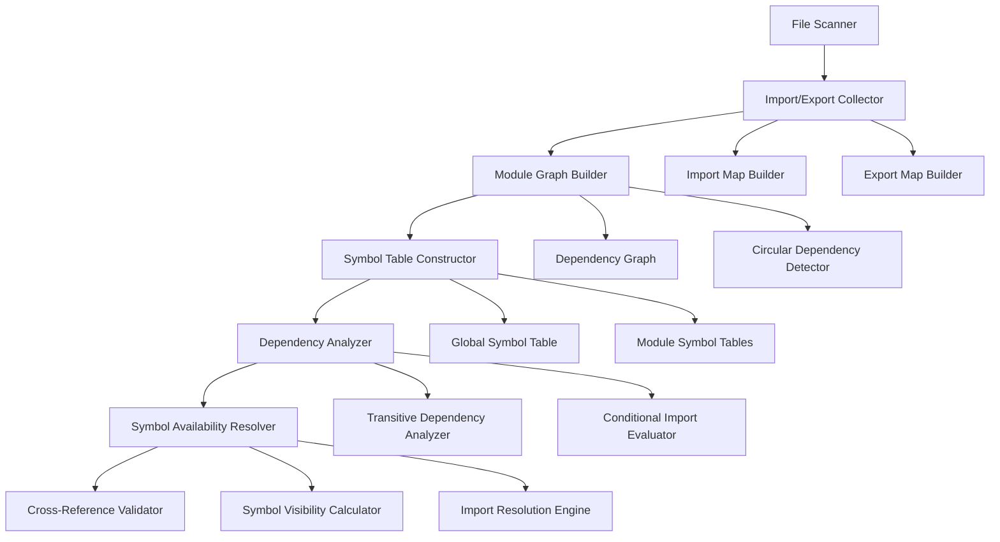

# Cross-File Symbol Resolution Engine Design

## Overview

The Cross-File Symbol Resolution Engine is responsible for tracking symbols (variables, functions, classes, etc.) across file boundaries to eliminate false positives and provide accurate symbol availability information. This component is crucial for understanding the complete module ecosystem of the application.

## Core Architecture

### Symbol Resolution Pipeline



## Module System Analysis

### Import/Export Collection

```javascript
class ImportExportCollector {
  constructor() {
    this.imports = new Map() // filePath -> Import[]
    this.exports = new Map() // filePath -> Export[]
    this.reExports = new Map() // filePath -> ReExport[]
    this.dynamicImports = new Map() // filePath -> DynamicImport[]
  }

  collectFromFile(filePath, ast) {
    const fileImports = []
    const fileExports = []
    const fileReExports = []
    const fileDynamicImports = []

    // Traverse AST to collect imports and exports
    this.traverseForImports(ast, fileImports, fileDynamicImports)
    this.traverseForExports(ast, fileExports, fileReExports)

    this.imports.set(filePath, fileImports)
    this.exports.set(filePath, fileExports)
    this.reExports.set(filePath, fileReExports)
    this.dynamicImports.set(filePath, fileDynamicImports)

    return {
      imports: fileImports,
      exports: fileExports,
      reExports: fileReExports,
      dynamicImports: fileDynamicImports
    }
  }

  traverseForImports(ast, imports, dynamicImports) {
    // ES6 imports
    this.traverse(ast, {
      ImportDeclaration: node => {
        const importInfo = this.analyzeImportDeclaration(node)
        imports.push(importInfo)
      },

      // CommonJS require
      CallExpression: node => {
        if (this.isRequireCall(node)) {
          const requireInfo = this.analyzeRequireCall(node)
          imports.push(requireInfo)
        }
      },

      // Dynamic import()
      ImportExpression: node => {
        const dynamicImportInfo = this.analyzeDynamicImport(node)
        dynamicImports.push(dynamicImportInfo)
      }
    })
  }

  analyzeImportDeclaration(node) {
    const source = node.source.value
    const specifiers = []

    node.specifiers.forEach(spec => {
      if (spec.type === 'ImportDefaultSpecifier') {
        specifiers.push({
          type: 'default',
          local: spec.local.name,
          imported: 'default'
        })
      } else if (spec.type === 'ImportSpecifier') {
        specifiers.push({
          type: 'named',
          local: spec.local.name,
          imported: spec.imported.name
        })
      } else if (spec.type === 'ImportNamespaceSpecifier') {
        specifiers.push({
          type: 'namespace',
          local: spec.local.name,
          imported: '*'
        })
      }
    })

    return {
      source,
      specifiers,
      node,
      isStatic: true,
      isConditional: this.isInConditionalContext(node)
    }
  }

  analyzeRequireCall(node) {
    const sourceArg = node.arguments[0]
    let source = null

    if (sourceArg.type === 'Literal') {
      source = sourceArg.value
    } else if (sourceArg.type === 'TemplateLiteral') {
      source = this.evaluateTemplateLiteral(sourceArg)
    }

    return {
      source,
      type: 'require',
      node,
      isStatic: source !== null,
      isConditional: this.isInConditionalContext(node)
    }
  }
}
```

### Module Graph Construction

```javascript
class ModuleGraphBuilder {
  constructor() {
    this.graph = new Map() // filePath -> ModuleNode
    this.reverseGraph = new Map() // filePath -> Set[dependents]
    this.circularDependencies = []
  }

  buildGraph(importExportData) {
    // Create nodes for all files
    this.createModuleNodes(importExportData)

    // Create edges based on imports
    this.createDependencyEdges(importExportData)

    // Detect circular dependencies
    this.detectCircularDependencies()

    // Calculate topological order
    this.calculateTopologicalOrder()

    return {
      graph: this.graph,
      reverseGraph: this.reverseGraph,
      circularDependencies: this.circularDependencies,
      topologicalOrder: this.topologicalOrder
    }
  }

  createModuleNodes(importExportData) {
    importExportData.forEach((data, filePath) => {
      const node = new ModuleNode(filePath, data)
      this.graph.set(filePath, node)
      this.reverseGraph.set(filePath, new Set())
    })
  }

  createDependencyEdges(importExportData) {
    importExportData.forEach((data, filePath) => {
      const moduleNode = this.graph.get(filePath)

      // Process static imports
      data.imports.forEach(importInfo => {
        if (importInfo.isStatic && importInfo.source) {
          const resolvedPath = this.resolveModulePath(importInfo.source, filePath)
          if (resolvedPath && this.graph.has(resolvedPath)) {
            moduleNode.addDependency(resolvedPath)
            this.reverseGraph.get(resolvedPath).add(filePath)
          }
        }
      })

      // Process re-exports
      data.reExports.forEach(reExport => {
        const resolvedPath = this.resolveModulePath(reExport.source, filePath)
        if (resolvedPath && this.graph.has(resolvedPath)) {
          moduleNode.addReExport(resolvedPath, reExport)
          this.reverseGraph.get(resolvedPath).add(filePath)
        }
      })
    })
  }

  detectCircularDependencies() {
    const visited = new Set()
    const recursionStack = new Set()
    const cycles = []

    const dfs = (node, path) => {
      if (recursionStack.has(node)) {
        // Found a cycle
        const cycleStart = path.indexOf(node)
        cycles.push(path.slice(cycleStart))
        return
      }

      if (visited.has(node)) {
        return
      }

      visited.add(node)
      recursionStack.add(node)
      path.push(node)

      const moduleNode = this.graph.get(node)
      moduleNode.dependencies.forEach(dep => {
        dfs(dep, [...path])
      })

      recursionStack.delete(node)
      path.pop()
    }

    this.graph.forEach((_, node) => {
      if (!visited.has(node)) {
        dfs(node, [])
      }
    })

    this.circularDependencies = cycles
  }
}

class ModuleNode {
  constructor(filePath, importExportData) {
    this.filePath = filePath
    this.importExportData = importExportData
    this.dependencies = new Set()
    this.dependents = new Set()
    this.reExports = []
    this.transitiveDependencies = new Set()
    this.level = 0
  }

  addDependency(filePath) {
    this.dependencies.add(filePath)
  }

  addReExport(filePath, reExportInfo) {
    this.reExports.push({ source: filePath, info: reExportInfo })
  }
}
```

## Symbol Table Construction

### Global Symbol Table

```javascript
class SymbolTableConstructor {
  constructor() {
    this.globalSymbolTable = new Map() // symbolName -> SymbolInfo[]
    this.moduleSymbolTables = new Map() // filePath -> SymbolTable
    this.exportedSymbols = new Map() // symbolName -> Set[filePath]
  }

  constructTables(moduleGraph, importExportData) {
    // Build individual module symbol tables
    this.buildModuleSymbolTables(importExportData)

    // Build global symbol table
    this.buildGlobalSymbolTable(moduleGraph)

    // Process re-exports
    this.processReExports(moduleGraph)

    return {
      globalTable: this.globalSymbolTable,
      moduleTables: this.moduleSymbolTables,
      exportedSymbols: this.exportedSymbols
    }
  }

  buildModuleSymbolTables(importExportData) {
    importExportData.forEach((data, filePath) => {
      const symbolTable = new SymbolTable(filePath)

      // Add exports to symbol table
      data.exports.forEach(exportInfo => {
        const symbol = this.createSymbolFromExport(exportInfo, filePath)
        symbolTable.addSymbol(symbol)

        // Track exported symbols globally
        if (!this.exportedSymbols.has(symbol.name)) {
          this.exportedSymbols.set(symbol.name, new Set())
        }
        this.exportedSymbols.get(symbol.name).add(filePath)
      })

      // Add local definitions
      this.addLocalDefinitions(symbolTable, filePath)

      this.moduleSymbolTables.set(filePath, symbolTable)
    })
  }

  buildGlobalSymbolTable(moduleGraph) {
    // Process in topological order to handle dependencies
    const order = moduleGraph.topologicalOrder

    order.forEach(filePath => {
      const moduleTable = this.moduleSymbolTables.get(filePath)
      const moduleNode = moduleGraph.graph.get(filePath)

      // Add module's symbols to global table
      moduleTable.symbols.forEach(symbol => {
        if (!this.globalSymbolTable.has(symbol.name)) {
          this.globalSymbolTable.set(symbol.name, [])
        }
        this.globalSymbolTable.get(symbol.name).push(symbol)
      })

      // Add symbols from re-exports
      moduleNode.reExports.forEach(reExport => {
        const sourceTable = this.moduleSymbolTables.get(reExport.source)
        if (sourceTable) {
          sourceTable.symbols.forEach(symbol => {
            if (this.shouldReExport(symbol, reExport.info)) {
              const reExportedSymbol = this.createReExportedSymbol(symbol, filePath, reExport)

              if (!this.globalSymbolTable.has(reExportedSymbol.name)) {
                this.globalSymbolTable.set(reExportedSymbol.name, [])
              }
              this.globalSymbolTable.get(reExportedSymbol.name).push(reExportedSymbol)
            }
          })
        }
      })
    })
  }
}

class SymbolTable {
  constructor(filePath) {
    this.filePath = filePath
    this.symbols = new Map() // symbolName -> SymbolInfo
    this.imports = new Map() // localName -> ImportInfo
    this.exports = new Map() // exportName -> ExportInfo
  }

  addSymbol(symbol) {
    this.symbols.set(symbol.name, symbol)
  }

  addImport(localName, importInfo) {
    this.imports.set(localName, importInfo)
  }

  addExport(exportName, exportInfo) {
    this.exports.set(exportName, exportInfo)
  }

  getSymbol(name) {
    return this.symbols.get(name)
  }

  hasSymbol(name) {
    return this.symbols.has(name)
  }
}
```

### Symbol Information Structure

```javascript
class SymbolInfo {
  constructor(name, type, source, filePath, node) {
    this.name = name
    this.type = type // 'function', 'class', 'variable', 'constant', 'import'
    this.source = source // where it comes from
    this.filePath = filePath
    this.node = node
    this.isExported = false
    this.isReExported = false
    this.originalSource = null
    this.dependents = new Set()
    this.visibility = 'module' // 'module', 'exported', 'global'
  }

  addDependent(filePath) {
    this.dependents.add(filePath)
  }

  setVisibility(visibility) {
    this.visibility = visibility
  }
}

class ImportInfo {
  constructor(localName, source, importedName, type) {
    this.localName = localName
    this.source = source
    this.importedName = importedName
    this.type = type // 'default', 'named', 'namespace'
    this.isStatic = true
    this.isConditional = false
    this.resolvedSymbol = null
  }
}

class ExportInfo {
  constructor(name, type, localName, node) {
    this.name = name
    this.type = type // 'default', 'named'
    this.localName = localName
    this.node = node
    this.isReExport = false
    this.originalSource = null
  }
}
```

## Symbol Availability Resolution

### Cross-File Resolution Engine

```javascript
class SymbolAvailabilityResolver {
  constructor(symbolTables, moduleGraph) {
    this.symbolTables = symbolTables
    this.moduleGraph = moduleGraph
    this.resolutionCache = new Map()
    this.globalSymbols = this.identifyGlobalSymbols()
  }

  isSymbolAvailable(symbolName, filePath, context = {}) {
    const cacheKey = `${symbolName}:${filePath}:${JSON.stringify(context)}`

    if (this.resolutionCache.has(cacheKey)) {
      return this.resolutionCache.get(cacheKey)
    }

    const result = this.resolveSymbol(symbolName, filePath, context)
    this.resolutionCache.set(cacheKey, result)

    return result
  }

  resolveSymbol(symbolName, filePath, context) {
    // Check local scope first
    const localResult = this.checkLocalScope(symbolName, filePath, context)
    if (localResult.available) {
      return localResult
    }

    // Check imports
    const importResult = this.checkImports(symbolName, filePath, context)
    if (importResult.available) {
      return importResult
    }

    // Check global symbols
    if (this.globalSymbols.has(symbolName)) {
      return {
        available: true,
        source: 'global',
        type: this.globalSymbols.get(symbolName).type,
        filePath: null
      }
    }

    // Check third-party libraries
    const libraryResult = this.checkThirdPartyLibraries(symbolName, context)
    if (libraryResult.available) {
      return libraryResult
    }

    // Check runtime-available symbols
    const runtimeResult = this.checkRuntimeSymbols(symbolName, filePath, context)
    if (runtimeResult.available) {
      return runtimeResult
    }

    return {
      available: false,
      reason: `Symbol '${symbolName}' not found in local scope, imports, or globals`
    }
  }

  checkLocalScope(symbolName, filePath, context) {
    const moduleTable = this.symbolTables.moduleTables.get(filePath)
    if (!moduleTable) {
      return { available: false }
    }

    const symbol = moduleTable.getSymbol(symbolName)
    if (symbol) {
      return {
        available: true,
        source: 'local',
        type: symbol.type,
        symbol: symbol,
        filePath: filePath
      }
    }

    return { available: false }
  }

  checkImports(symbolName, filePath, context) {
    const moduleTable = this.symbolTables.moduleTables.get(filePath)
    if (!moduleTable) {
      return { available: false }
    }

    const importInfo = moduleTable.imports.get(symbolName)
    if (!importInfo) {
      return { available: false }
    }

    // Resolve the import to its source
    const resolvedPath = this.resolveImportPath(importInfo.source, filePath)
    if (!resolvedPath) {
      return {
        available: false,
        reason: `Could not resolve import path: ${importInfo.source}`
      }
    }

    // Handle different import types
    if (importInfo.type === 'namespace') {
      // Namespace import - symbol should be accessed as namespace.symbol
      return this.checkNamespaceAccess(importInfo, symbolName, resolvedPath, context)
    } else {
      // Direct import - symbol should be available directly
      return this.checkDirectImport(importInfo, resolvedPath, context)
    }
  }

  checkDirectImport(importInfo, sourcePath, context) {
    const sourceTable = this.symbolTables.moduleTables.get(sourcePath)
    if (!sourceTable) {
      return { available: false }
    }

    let symbolName = importInfo.importedName
    if (importInfo.type === 'default') {
      symbolName = 'default'
    }

    const symbol = sourceTable.getSymbol(symbolName)
    if (symbol) {
      return {
        available: true,
        source: 'import',
        type: symbol.type,
        symbol: symbol,
        importInfo: importInfo,
        filePath: sourcePath
      }
    }

    // Check if it's a re-export
    const reExportResult = this.checkReExports(symbolName, sourcePath)
    if (reExportResult.available) {
      return reExportResult
    }

    return { available: false }
  }

  checkReExports(symbolName, filePath) {
    const moduleNode = this.moduleGraph.graph.get(filePath)
    if (!moduleNode) {
      return { available: false }
    }

    for (const reExport of moduleNode.reExports) {
      const sourceTable = this.symbolTables.moduleTables.get(reExport.source)
      if (sourceTable) {
        const symbol = sourceTable.getSymbol(symbolName)
        if (symbol && this.shouldReExport(symbol, reExport.info)) {
          return {
            available: true,
            source: 're-export',
            type: symbol.type,
            symbol: symbol,
            filePath: reExport.source
          }
        }
      }
    }

    return { available: false }
  }

  identifyGlobalSymbols() {
    const globals = new Map()

    // JavaScript built-ins
    GLOBAL_FUNCTIONS.forEach(name => {
      globals.set(name, { type: 'builtin', source: 'javascript' })
    })

    // Web APIs (for frontend code)
    WEB_APIS.forEach(name => {
      globals.set(name, { type: 'builtin', source: 'web' })
    })

    // Node.js globals (for backend code)
    NODE_GLOBALS.forEach(name => {
      globals.set(name, { type: 'builtin', source: 'node' })
    })

    return globals
  }

  checkThirdPartyLibraries(symbolName, context) {
    // Check common third-party libraries
    const thirdPartySymbols = this.identifyThirdPartySymbols()

    if (thirdPartySymbols.has(symbolName)) {
      const info = thirdPartySymbols.get(symbolName)
      return {
        available: true,
        source: 'third-party',
        type: info.type,
        library: info.library,
        version: info.version
      }
    }

    return { available: false }
  }

  checkRuntimeSymbols(symbolName, filePath, context) {
    // Check symbols that might be available at runtime
    // through dynamic loading, script tags, etc.

    const moduleTable = this.symbolTables.moduleTables.get(filePath)
    if (!moduleTable) {
      return { available: false }
    }

    // Check for dynamic imports that might provide this symbol
    const dynamicImports = this.getDynamicImportsForFile(filePath)
    for (const dynImport of dynamicImports) {
      if (this.dynamicImportMightProvide(dynImport, symbolName)) {
        return {
          available: true,
          source: 'dynamic',
          type: 'dynamic',
          dynamicImport: dynImport,
          condition: 'might be available at runtime'
        }
      }
    }

    return { available: false }
  }
}
```

## Integration with Existing Verifier

### Enhanced FunctionDatabase Integration

```javascript
class EnhancedFunctionDatabase extends FunctionDatabase {
  constructor() {
    super()
    this.symbolResolver = null
    this.moduleGraph = null
    this.symbolTables = null
  }

  setSymbolResolver(resolver) {
    this.symbolResolver = resolver
  }

  setModuleGraph(graph) {
    this.moduleGraph = graph
  }

  setSymbolTables(tables) {
    this.symbolTables = tables
  }

  // Override validation methods to use cross-file resolution
  validateFunctionCall(filePath, functionName, line, col) {
    // Use symbol resolver for comprehensive validation
    const resolution = this.symbolResolver.isSymbolAvailable(functionName, filePath)

    if (!resolution.available) {
      this.addViolation({
        type: 'FUNCTION_NOT_FOUND',
        severity: 'error',
        file: filePath,
        line,
        column: col,
        function: functionName,
        reason: resolution.reason
      })
    }
  }

  validateMemberCall(filePath, objectName, methodName, line, col) {
    // Check if object is available
    const objectResolution = this.symbolResolver.isSymbolAvailable(objectName, filePath)

    if (!objectResolution.available) {
      this.addViolation({
        type: 'OBJECT_NOT_AVAILABLE',
        severity: 'error',
        file: filePath,
        line,
        column: col,
        object: objectName,
        method: methodName,
        reason: objectResolution.reason
      })
      return
    }

    // Check if method is available on the object
    const methodResolution = this.symbolResolver.isMethodAvailable(
      objectName,
      methodName,
      filePath,
      objectResolution
    )

    if (!methodResolution.available) {
      this.addViolation({
        type: 'METHOD_NOT_AVAILABLE',
        severity: 'error',
        file: filePath,
        line,
        column: col,
        object: objectName,
        method: methodName,
        reason: methodResolution.reason
      })
    }
  }
}
```

## Expected Improvements

1. **Eliminate false positives for global objects**: Properly identify and track globally available symbols
2. **Handle re-exports correctly**: Follow re-export chains to find symbol origins
3. **Support namespace imports**: Properly validate access to imported namespaces
4. **Track dynamic imports**: Understand symbols that might be available at runtime
5. **Handle module resolution**: Properly resolve module paths across different module systems
6. **Support conditional imports**: Analyze imports in conditional contexts
7. **Detect circular dependencies**: Identify and handle circular import patterns
8. **Provide accurate symbol sources**: Know exactly where each symbol comes from

This Cross-File Symbol Resolution Engine provides the foundation for accurate symbol tracking across the entire application, significantly reducing false positives and improving verification accuracy.
