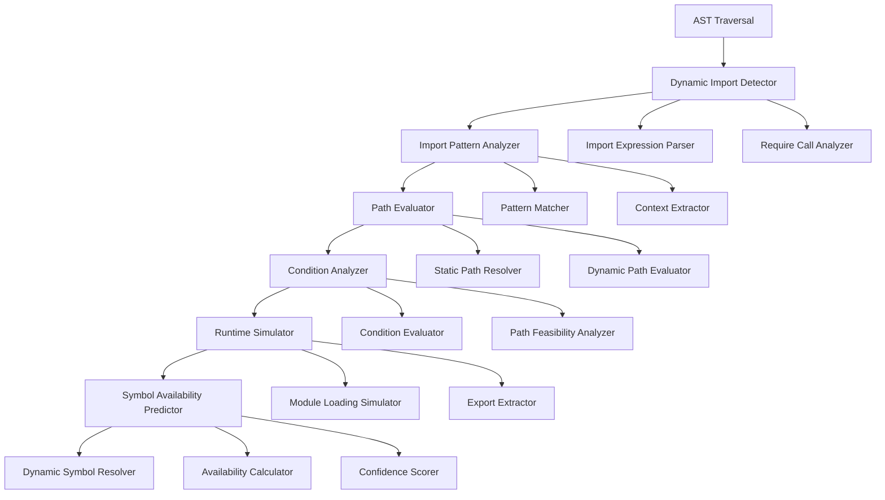

# Dynamic Import Resolution System Design

## Overview

The Dynamic Import Resolution System is designed to handle dynamic module loading patterns that are not statically analyzable through traditional AST analysis. This component is crucial for modern JavaScript applications that use dynamic imports, conditional loading, and runtime module resolution.

## Dynamic Import Patterns

### Common Dynamic Import Patterns

```javascript
// 1. Basic dynamic import
const module = await import('./module.js')

// 2. Conditional dynamic import
if (condition) {
  const module = await import('./conditional-module.js')
}

// 3. Computed module path
const moduleName = getModuleName()
const module = await import(`./modules/${moduleName}.js`)

// 4. Dynamic require (CommonJS)
const module = require(dynamicPath)

// 5. Lazy loading
const loadModule = async () => {
  const module = await import('./heavy-module.js')
  return module.default
}

// 6. Dynamic import with variable assignment
const { specificExport } = await import('./module.js')

// 7. Dynamic import in try-catch
try {
  const module = await import('./optional-module.js')
} catch (error) {
  // Handle missing module
}

// 8. Dynamic import based on configuration
const config = await import(`./config/${environment}.js`)
```

## Core Architecture

### Dynamic Import Analysis Pipeline



## Dynamic Import Detection

### Import Pattern Recognition

```javascript
class DynamicImportDetector {
  constructor() {
    this.patterns = new Map()
    this.registerPatterns()
  }

  registerPatterns() {
    // Dynamic import() patterns
    this.patterns.set('importExpression', {
      nodeType: 'ImportExpression',
      analyzer: this.analyzeImportExpression.bind(this)
    })

    // Dynamic require() patterns
    this.patterns.set('requireCall', {
      nodeType: 'CallExpression',
      matcher: node => this.isDynamicRequire(node),
      analyzer: this.analyzeRequireCall.bind(this)
    })

    // Conditional import patterns
    this.patterns.set('conditionalImport', {
      nodeType: 'IfStatement',
      matcher: node => this.hasImportInConditional(node),
      analyzer: this.analyzeConditionalImport.bind(this)
    })

    // Computed path patterns
    this.patterns.set('computedPath', {
      nodeType: 'TemplateLiteral',
      context: 'import',
      analyzer: this.analyzeComputedPath.bind(this)
    })
  }

  detectDynamicImports(ast, filePath) {
    const dynamicImports = []

    this.traverse(ast, {
      ImportExpression: node => {
        const importInfo = this.analyzeImportExpression(node, filePath)
        dynamicImports.push(importInfo)
      },

      CallExpression: node => {
        if (this.isDynamicRequire(node)) {
          const requireInfo = this.analyzeRequireCall(node, filePath)
          dynamicImports.push(requireInfo)
        }
      },

      IfStatement: node => {
        const conditionalImports = this.analyzeConditionalImport(node, filePath)
        dynamicImports.push(...conditionalImports)
      }
    })

    return dynamicImports
  }

  analyzeImportExpression(node, filePath) {
    const source = node.source
    let pathInfo = null

    if (source.type === 'Literal') {
      // Static string path
      pathInfo = {
        type: 'static',
        value: source.value,
        resolvable: true
      }
    } else if (source.type === 'TemplateLiteral') {
      // Template literal with potential variables
      pathInfo = this.analyzeTemplateLiteral(source)
    } else if (source.type === 'Identifier') {
      // Variable containing the path
      pathInfo = {
        type: 'variable',
        name: source.name,
        resolvable: false
      }
    } else if (source.type === 'CallExpression') {
      // Function call returning the path
      pathInfo = {
        type: 'computed',
        expression: source,
        resolvable: false
      }
    }

    return {
      type: 'dynamic-import',
      node,
      filePath,
      pathInfo,
      context: this.extractContext(node),
      conditions: this.extractConditions(node),
      usage: this.analyzeUsage(node)
    }
  }

  analyzeTemplateLiteral(templateLiteral) {
    const parts = []
    const expressions = []

    templateLiteral.quasis.forEach((quasi, index) => {
      parts.push(quasi.value.raw)

      if (index < templateLiteral.expressions.length) {
        const expr = templateLiteral.expressions[index]
        expressions.push(expr)
        parts.push(`\${{expr${index}}}`)
      }
    })

    // Try to evaluate if all expressions are literals
    const canEvaluate = expressions.every(expr => expr.type === 'Literal')

    if (canEvaluate) {
      const evaluatedValue = this.evaluateTemplateLiteral(templateLiteral)
      return {
        type: 'static',
        value: evaluatedValue,
        resolvable: true,
        template: parts.join('')
      }
    }

    return {
      type: 'template',
      parts,
      expressions,
      resolvable: false,
      template: parts.join('')
    }
  }

  isDynamicRequire(node) {
    return (
      node.callee.type === 'Identifier' &&
      node.callee.name === 'require' &&
      node.arguments.length > 0
    )
  }

  analyzeRequireCall(node, filePath) {
    const arg = node.arguments[0]
    let pathInfo = null

    if (arg.type === 'Literal') {
      pathInfo = {
        type: 'static',
        value: arg.value,
        resolvable: true
      }
    } else {
      pathInfo = {
        type: 'dynamic',
        expression: arg,
        resolvable: false
      }
    }

    return {
      type: 'dynamic-require',
      node,
      filePath,
      pathInfo,
      context: this.extractContext(node),
      conditions: this.extractConditions(node)
    }
  }
}
```

## Path Evaluation and Resolution

### Dynamic Path Evaluator

```javascript
class DynamicPathEvaluator {
  constructor(moduleResolver) {
    this.moduleResolver = moduleResolver
    this.pathCache = new Map()
    this.variableTracker = new VariableTracker()
  }

  evaluatePath(pathInfo, context) {
    if (pathInfo.resolvable) {
      return this.resolveStaticPath(pathInfo.value, context.filePath)
    }

    switch (pathInfo.type) {
      case 'template':
        return this.evaluateTemplatePath(pathInfo, context)
      case 'variable':
        return this.evaluateVariablePath(pathInfo, context)
      case 'computed':
        return this.evaluateComputedPath(pathInfo, context)
      default:
        return { possiblePaths: [], confidence: 0 }
    }
  }

  evaluateTemplatePath(pathInfo, context) {
    const possibleValues = []

    // Try to evaluate template expressions
    const evaluatedExpressions = pathInfo.expressions.map(expr =>
      this.evaluateExpression(expr, context)
    )

    // If all expressions can be evaluated to specific values
    if (evaluatedExpressions.every(eval => eval.type === 'concrete')) {
      const concreteValues = evaluatedExpressions.map(eval => eval.value)
      const resolvedPath = this.buildPathFromTemplate(pathInfo.parts, concreteValues)

      if (resolvedPath) {
        const resolved = this.resolveStaticPath(resolvedPath, context.filePath)
        if (resolved.exists) {
          possibleValues.push(resolved)
        }
      }
    }

    // If expressions have limited value ranges
    if (evaluatedExpressions.some(eval => eval.type === 'range')) {
      const possiblePaths = this.generatePathsFromRanges(
        pathInfo.parts,
        evaluatedExpressions,
        context.filePath
      )
      possibleValues.push(...possiblePaths)
    }

    return {
      possiblePaths: possibleValues,
      confidence: this.calculateConfidence(possibleValues, pathInfo),
      evaluationType: 'template'
    }
  }

  evaluateVariablePath(pathInfo, context) {
    const variableName = pathInfo.name
    const variableInfo = this.variableTracker.getVariableInfo(variableName, context.filePath)

    if (!variableInfo) {
      return { possiblePaths: [], confidence: 0 }
    }

    const possibleValues = []

    // Check if variable has limited possible values
    if (variableInfo.type === 'enum') {
      variableInfo.possibleValues.forEach(value => {
        const resolved = this.resolveStaticPath(value, context.filePath)
        if (resolved.exists) {
          possibleValues.push(resolved)
        }
      })
    } else if (variableInfo.type === 'string' && variableInfo.pattern) {
      // Try to match pattern against existing files
      const matches = this.findFilesMatchingPattern(variableInfo.pattern, context.filePath)
      possibleValues.push(...matches)
    }

    return {
      possiblePaths: possibleValues,
      confidence: this.calculateConfidence(possibleValues, pathInfo),
      evaluationType: 'variable'
    }
  }

  evaluateComputedPath(pathInfo, context) {
    // Try to analyze the computed expression
    const analysis = this.analyzeExpression(pathInfo.expression, context)

    if (analysis.type === 'function-call') {
      // Check if it's a known path resolver function
      return this.evaluateFunctionCall(analysis, context)
    } else if (analysis.type === 'property-access') {
      // Check if it's accessing a configuration object
      return this.evaluatePropertyAccess(analysis, context)
    }

    return { possiblePaths: [], confidence: 0 }
  }

  resolveStaticPath(path, fromFile) {
    const resolved = this.moduleResolver.resolve(path, fromFile)

    if (resolved && this.fileExists(resolved)) {
      return {
        path: resolved,
        exists: true,
        moduleInfo: this.getModuleInfo(resolved)
      }
    }

    return {
      path: resolved,
      exists: false
    }
  }
}
```

## Condition Analysis

### Conditional Import Analyzer

```javascript
class ConditionalImportAnalyzer {
  constructor(controlFlowAnalyzer) {
    this.controlFlowAnalyzer = controlFlowAnalyzer
    this.conditionEvaluator = new ConditionEvaluator()
  }

  analyzeConditionalImports(dynamicImport, context) {
    if (!dynamicImport.conditions || dynamicImport.conditions.length === 0) {
      return {
        isConditional: false,
        feasibility: 1.0,
        conditions: []
      }
    }

    const analyzedConditions = dynamicImport.conditions.map(condition =>
      this.analyzeCondition(condition, context)
    )

    const overallFeasibility = this.calculateOverallFeasibility(analyzedConditions)

    return {
      isConditional: true,
      feasibility: overallFeasibility,
      conditions: analyzedConditions,
      executionPaths: this.identifyExecutionPaths(analyzedConditions)
    }
  }

  analyzeCondition(condition, context) {
    const analysis = this.conditionEvaluator.evaluate(condition, context)

    return {
      expression: condition,
      type: analysis.type, // 'boolean', 'comparison', 'function-call'
      truthiness: analysis.truthiness, // 0-1 probability of being true
      dependencies: analysis.dependencies,
      context: analysis.context
    }
  }

  calculateOverallFeasibility(conditions) {
    // Calculate the probability that the import will be executed
    // based on the conditions it's wrapped in

    if (conditions.length === 0) {
      return 1.0
    }

    // For nested conditions, multiply probabilities
    let feasibility = 1.0
    for (const condition of conditions) {
      feasibility *= condition.truthiness
    }

    return feasibility
  }

  identifyExecutionPaths(conditions) {
    // Identify different execution paths that could lead to the import
    const paths = []

    // Simple case: single if condition
    if (conditions.length === 1) {
      const condition = conditions[0]
      paths.push({
        type: 'conditional',
        condition: condition.expression,
        feasibility: condition.truthiness
      })
    }

    // Complex case: multiple nested conditions
    if (conditions.length > 1) {
      paths.push({
        type: 'nested-conditional',
        conditions: conditions.map(c => c.expression),
        feasibility: conditions.reduce((acc, c) => acc * c.truthiness, 1.0)
      })
    }

    return paths
  }
}
```

## Runtime Simulation

### Dynamic Import Simulator

```javascript
class DynamicImportSimulator {
  constructor(moduleLoader) {
    this.moduleLoader = moduleLoader
    this.simulationCache = new Map()
  }

  simulateDynamicImport(dynamicImport, context) {
    const cacheKey = this.generateCacheKey(dynamicImport, context)

    if (this.simulationCache.has(cacheKey)) {
      return this.simulationCache.get(cacheKey)
    }

    const simulation = this.performSimulation(dynamicImport, context)
    this.simulationCache.set(cacheKey, simulation)

    return simulation
  }

  performSimulation(dynamicImport, context) {
    // Simulate what would be available at runtime
    const pathEvaluation = this.evaluatePaths(dynamicImport, context)
    const conditionAnalysis = this.analyzeConditions(dynamicImport, context)

    const possibleModules = []

    // For each possible path, try to load the module
    pathEvaluation.possiblePaths.forEach(pathInfo => {
      try {
        const moduleInfo = this.moduleLoader.loadModule(pathInfo.path)
        if (moduleInfo) {
          possibleModules.push({
            path: pathInfo.path,
            module: moduleInfo,
            confidence: pathInfo.confidence * conditionAnalysis.feasibility,
            exports: this.extractExports(moduleInfo)
          })
        }
      } catch (error) {
        // Module might not exist or be loadable
        console.warn(`Could not simulate module load for ${pathInfo.path}:`, error.message)
      }
    })

    return {
      possibleModules,
      overallConfidence: this.calculateOverallConfidence(possibleModules),
      runtimeSymbols: this.extractRuntimeSymbols(possibleModules),
      conditionalAvailability: conditionAnalysis.feasibility
    }
  }

  extractExports(moduleInfo) {
    const exports = []

    // Extract named exports
    if (moduleInfo.namedExports) {
      exports.push(
        ...moduleInfo.namedExports.map(name => ({
          name,
          type: 'named',
          isDefault: false
        }))
      )
    }

    // Extract default export
    if (moduleInfo.defaultExport) {
      exports.push({
        name: 'default',
        type: 'default',
        isDefault: true
      })
    }

    // Extract namespace export
    if (moduleInfo.namespaceExport) {
      exports.push({
        name: '*',
        type: 'namespace',
        isDefault: false
      })
    }

    return exports
  }

  extractRuntimeSymbols(possibleModules) {
    const symbols = new Map()

    possibleModules.forEach(module => {
      module.exports.forEach(exportInfo => {
        if (!symbols.has(exportInfo.name)) {
          symbols.set(exportInfo.name, {
            name: exportInfo.name,
            type: exportInfo.type,
            sources: [],
            confidence: 0
          })
        }

        const symbol = symbols.get(exportInfo.name)
        symbol.sources.push({
          path: module.path,
          confidence: module.confidence,
          exportType: exportInfo.type
        })

        // Update overall confidence
        symbol.confidence = Math.max(symbol.confidence, module.confidence)
      })
    })

    return symbols
  }
}
```

## Symbol Availability Prediction

### Dynamic Symbol Resolver

```javascript
class DynamicSymbolResolver {
  constructor(dynamicImportSimulator, pathEvaluator) {
    this.simulator = dynamicImportSimulator
    this.pathEvaluator = pathEvaluator
    this.symbolCache = new Map()
  }

  resolveDynamicSymbol(symbolName, filePath, context) {
    const cacheKey = `${symbolName}:${filePath}:${context.hashCode()}`

    if (this.symbolCache.has(cacheKey)) {
      return this.symbolCache.get(cacheKey)
    }

    const resolution = this.performResolution(symbolName, filePath, context)
    this.symbolCache.set(cacheKey, resolution)

    return resolution
  }

  performResolution(symbolName, filePath, context) {
    // Find all dynamic imports in the file
    const dynamicImports = this.findDynamicImports(filePath)

    const possibleSources = []

    for (const dynImport of dynamicImports) {
      // Simulate the dynamic import
      const simulation = this.simulator.simulateDynamicImport(dynImport, context)

      // Check if the symbol might be provided by this import
      const symbolInfo = simulation.runtimeSymbols.get(symbolName)

      if (symbolInfo) {
        possibleSources.push({
          type: 'dynamic-import',
          importNode: dynImport.node,
          sources: symbolInfo.sources,
          confidence: symbolInfo.confidence * simulation.conditionalAvailability,
          conditions: dynImport.conditions,
          pathEvaluation: this.pathEvaluator.evaluatePath(dynImport.pathInfo, context)
        })
      }
    }

    // Also check for dynamic require calls
    const dynamicRequires = this.findDynamicRequires(filePath)

    for (const dynRequire of dynamicRequires) {
      const simulation = this.simulator.simulateDynamicRequire(dynRequire, context)
      const symbolInfo = simulation.runtimeSymbols.get(symbolName)

      if (symbolInfo) {
        possibleSources.push({
          type: 'dynamic-require',
          requireNode: dynRequire.node,
          sources: symbolInfo.sources,
          confidence: symbolInfo.confidence * simulation.conditionalAvailability,
          conditions: dynRequire.conditions
        })
      }
    }

    // Calculate overall resolution
    if (possibleSources.length === 0) {
      return {
        available: false,
        reason: `Symbol '${symbolName}' not found in dynamic imports`
      }
    }

    const overallConfidence = this.calculateOverallConfidence(possibleSources)

    return {
      available: overallConfidence > 0.1, // Threshold for considering available
      confidence: overallConfidence,
      sources: possibleSources,
      type: 'dynamic',
      conditions: this.combineConditions(possibleSources)
    }
  }

  calculateOverallConfidence(sources) {
    if (sources.length === 0) {
      return 0
    }

    // Use the highest confidence among all possible sources
    return Math.max(...sources.map(source => source.confidence))
  }

  combineConditions(sources) {
    const allConditions = []

    sources.forEach(source => {
      if (source.conditions) {
        allConditions.push(...source.conditions)
      }
    })

    return allConditions
  }
}
```

## Integration with Existing Verifier

### Enhanced Validation Integration

```javascript
class EnhancedDynamicImportValidator {
  constructor(dynamicImportDetector, pathEvaluator, symbolResolver) {
    this.detector = dynamicImportDetector
    this.pathEvaluator = pathEvaluator
    this.symbolResolver = symbolResolver
  }

  validateFileWithDynamicImports(filePath, ast, db) {
    // Detect all dynamic imports
    const dynamicImports = this.detector.detectDynamicImports(ast, filePath)

    // Store dynamic import information
    db.setDynamicImports(filePath, dynamicImports)

    // Validate each dynamic import
    dynamicImports.forEach(dynImport => {
      this.validateDynamicImport(dynImport, db)
    })
  }

  validateDynamicImport(dynImport, db) {
    // Evaluate possible paths
    const pathEvaluation = this.pathEvaluator.evaluatePath(dynImport.pathInfo, {
      filePath: dynImport.filePath
    })

    // Check if any paths are resolvable
    if (pathEvaluation.possiblePaths.length === 0) {
      db.addViolation({
        type: 'DYNAMIC_IMPORT_UNRESOLVABLE',
        severity: 'warning',
        file: dynImport.filePath,
        line: dynImport.node.loc.start.line,
        column: dynImport.node.loc.start.column,
        importInfo: dynImport,
        reason: 'Dynamic import path could not be resolved'
      })
    }

    // Check conditional feasibility
    if (dynImport.conditions && dynImport.conditions.length > 0) {
      const feasibility = this.calculateConditionFeasibility(dynImport.conditions)

      if (feasibility < 0.1) {
        db.addViolation({
          type: 'DYNAMIC_IMPORT_UNLIKELY',
          severity: 'info',
          file: dynImport.filePath,
          line: dynImport.node.loc.start.line,
          column: dynImport.node.loc.start.column,
          importInfo: dynImport,
          reason: `Dynamic import has low feasibility (${feasibility.toFixed(2)})`
        })
      }
    }
  }

  validateSymbolUsageWithDynamicImports(symbolName, filePath, line, col, db) {
    // Check if symbol might be available through dynamic imports
    const resolution = this.symbolResolver.resolveDynamicSymbol(symbolName, filePath, { line, col })

    if (resolution.available) {
      // Symbol is available through dynamic imports
      // Don't report as violation, but record the resolution
      db.addDynamicSymbolResolution({
        symbol: symbolName,
        file: filePath,
        line,
        column: col,
        resolution
      })

      return true // Symbol is available
    }

    return false // Symbol not found
  }
}
```

## Expected Improvements

1. **Handle dynamic import() expressions**: Properly analyze and validate dynamic imports
2. **Support conditional imports**: Understand imports inside conditional blocks
3. **Resolve template literal paths**: Evaluate paths with template literals and variables
4. **Simulate runtime behavior**: Predict what symbols will be available at runtime
5. **Reduce false positives**: Don't flag symbols that might be available through dynamic imports
6. **Handle lazy loading**: Understand lazy loading patterns and their implications
7. **Support computed paths**: Analyze paths computed at runtime
8. **Track import conditions**: Understand the conditions under which imports are executed

This Dynamic Import Resolution System provides comprehensive handling of modern JavaScript dynamic import patterns, significantly improving verification accuracy for codebases that use dynamic module loading.
