# Enhanced Function Implementation Verifier Architecture

## Overview

This document outlines the architecture for an enhanced function implementation verifier that achieves 100% accuracy without using regular expressions or TypeScript dependencies. The design builds upon the existing implementation while incorporating advanced AST analysis techniques.

## Current Limitations Analysis

Based on the existing implementation, the following limitations have been identified:

1. **False positives for objects not imported (889 violations)**: Objects that are available globally or through other means are incorrectly flagged
2. **Dynamic method access not detected**: Methods accessed via bracket notation or computed properties are missed
3. **Cross-file variable tracking incomplete**: Variables defined in one file and used in another are not properly tracked
4. **Conditional imports not fully handled**: Import statements inside conditional blocks are not properly analyzed
5. **Prototype chain methods only checking immediate prototype**: Inherited methods from deeper prototype chains are missed
6. **Third-party library objects not explicitly imported**: Objects from libraries loaded via script tags are not recognized
7. **Method chaining complexity**: Chained method calls are not properly validated
8. **Async/await patterns with dynamic loading**: Async patterns that dynamically load modules are not handled

## Enhanced Architecture Design

### Core Components

```mermaid
graph TB
    A[Enhanced Function Verifier] --> B[Advanced AST Analyzer]
    A --> C[Cross-File Symbol Resolver]
    A --> D[Dynamic Import Tracker]
    A --> E[Prototype Chain Validator]
    A --> F[Control Flow Analyzer]
    A --> G[Type Inference Engine]
    A --> H[Symbolic Execution Engine]

    B --> I[Acorn Parser Enhanced]
    B --> J[Scope Analyzer]
    B --> K[Binding Resolver]

    C --> L[Import Map Builder]
    C --> M[Export Tracker]
    C --> N[Module Graph Constructor]

    D --> O[Dynamic Import Detector]
    D --> P[Conditional Import Analyzer]
    D --> Q[Runtime Module Loader]

    E --> R[Prototype Walker]
    E --> S[Method Availability Checker]
    E --> T[Inheritance Chain Analyzer]

    F --> U[Control Flow Graph Builder]
    F --> V[Path Analyzer]
    F --> W[Condition Evaluator]

    G --> X[Type Inference Engine]
    G --> Y[JSDoc Parser]
    G --> Z[Usage Pattern Analyzer]

    H --> AA[Symbolic Executor]
    H --> BB[Path Explorer]
    H --> CC[Value Range Analyzer]
```



## Component Design Details

### 1. Advanced AST Analyzer

**Purpose**: Enhance the existing AST analysis with deeper semantic understanding

**Key Features**:

- Enhanced Acorn parser with custom plugins for dynamic constructs
- Scope analysis to track variable visibility and lifetime
- Binding resolution to understand variable references
- Pattern matching for complex access patterns

**Implementation Approach**:

```javascript
class AdvancedASTAnalyzer {
  constructor() {
    this.parser = this.createEnhancedParser()
    this.scopeAnalyzer = new ScopeAnalyzer()
    this.bindingResolver = new BindingResolver()
  }

  createEnhancedParser() {
    // Extend Acorn with custom plugins for dynamic imports, etc.
    return parse.extend(dynamicImportPlugin, objectRestSpreadPlugin, classPropertiesPlugin)
  }

  analyzeWithSemantics(ast, filePath) {
    const scopeInfo = this.scopeAnalyzer.analyze(ast)
    const bindings = this.bindingResolver.resolve(ast, scopeInfo)
    return { ast, scopeInfo, bindings }
  }
}
```

### 2. Cross-File Symbol Resolution Engine

**Purpose**: Track symbols across file boundaries to eliminate false positives

**Key Features**:

- Import map construction across all files
- Export tracking for all modules
- Module dependency graph construction
- Symbol availability analysis

**Implementation Approach**:

```javascript
class CrossFileSymbolResolver {
  constructor() {
    this.importMaps = new Map() // filePath -> importMap
    this.exports = new Map() // filePath -> exports
    this.moduleGraph = new Map() // filePath -> dependencies
  }

  buildSymbolTable(allFiles) {
    // First pass: collect all exports
    this.collectExports(allFiles)

    // Second pass: build import maps
    this.buildImportMaps(allFiles)

    // Third pass: resolve symbol availability
    return this.resolveSymbolAvailability()
  }

  isSymbolAvailable(symbolName, filePath) {
    const importMap = this.importMaps.get(filePath)
    const exports = this.exports.get(filePath)

    // Check local, imported, and global availability
    return (
      this.checkLocalScope(symbolName, filePath) ||
      this.checkImports(symbolName, importMap) ||
      this.checkGlobals(symbolName) ||
      this.checkThirdPartyLibraries(symbolName)
    )
  }
}
```

### 3. Dynamic Import Resolution System

**Purpose**: Handle dynamic and conditional imports that are not statically analyzable

**Key Features**:

- Dynamic import detection and tracking
- Conditional import analysis
- Runtime module loading simulation
- Lazy evaluation patterns

**Implementation Approach**:

```javascript
class DynamicImportResolver {
  constructor() {
    this.dynamicImports = new Map() // filePath -> dynamicImports
    this.conditionalImports = new Map() // filePath -> conditionalImports
    this.runtimeModules = new Set() // modules available at runtime
  }

  detectDynamicImports(ast, filePath) {
    // Detect import()
    // Detect require() with variables
    // Detect conditional imports

    return {
      dynamicImports: this.extractDynamicImports(ast),
      conditionalImports: this.extractConditionalImports(ast),
      runtimeDependencies: this.identifyRuntimeDependencies(ast)
    }
  }

  simulateRuntimeLoading(dynamicImport) {
    // Simulate what would be available at runtime
    // based on dynamic import patterns
  }
}
```

### 4. Prototype Chain Method Validation

**Purpose**: Properly validate methods available through prototype chains

**Key Features**:

- Complete prototype chain traversal
- Method availability checking at all levels
- Inheritance pattern recognition
- Mixin and composition support

**Implementation Approach**:

```javascript
class PrototypeChainValidator {
  constructor() {
    this.prototypeChains = new Map() // objectName -> prototypeChain
    this.methodRegistry = new Map() // method -> availableOn
  }

  buildPrototypeChain(objectName) {
    // Walk the complete prototype chain
    // Account for dynamic modifications
    // Include mixins and composition patterns
  }

  validateMethodAccess(objectName, methodName) {
    const chain = this.getPrototypeChain(objectName)
    return this.isMethodInChain(methodName, chain)
  }

  isMethodInChain(methodName, prototypeChain) {
    for (const prototype of prototypeChain) {
      if (prototype.methods.has(methodName)) {
        return { available: true, source: prototype.source }
      }
    }
    return { available: false }
  }
}
```

### 5. Control Flow Analysis

**Purpose**: Understand the flow of execution to determine when symbols are available

**Key Features**:

- Control flow graph construction
- Path analysis for conditional code
- Dead code elimination
- Reachability analysis

**Implementation Approach**:

```javascript
class ControlFlowAnalyzer {
  constructor() {
    this.cfgBuilder = new ControlFlowGraphBuilder()
    this.pathAnalyzer = new PathAnalyzer()
  }

  buildCFG(ast) {
    // Build control flow graph from AST
    return this.cfgBuilder.build(ast)
  }

  analyzeSymbolAvailability(symbolName, cfg, entryPoint) {
    // Track symbol availability through different paths
    const paths = this.pathAnalyzer.findAllPaths(cfg, entryPoint)
    return this.evaluateAvailabilityAcrossPaths(symbolName, paths)
  }

  evaluateAvailabilityAcrossPaths(symbolName, paths) {
    // Determine if symbol is available in all possible
    // execution paths that reach its usage
  }
}
```

### 6. Advanced Type Inference for JavaScript

**Purpose**: Infer types to better understand object capabilities and method availability

**Key Features**:

- JSDoc parsing for type information
- Usage pattern analysis
- Type propagation through assignments
- Union and intersection type handling

**Implementation Approach**:

```javascript
class TypeInferenceEngine {
  constructor() {
    this.typeCache = new Map() // variable -> inferredType
    this.jsdocParser = new JSDocParser()
  }

  inferTypes(ast, scopeInfo) {
    // Analyze JSDoc comments
    // Track assignments and usage patterns
    // Propagate types through the code
  }

  inferMethodReturnType(functionNode) {
    // Analyze return statements
    // Consider conditional returns
    // Handle async functions
  }

  getAvailableMethods(objectType) {
    // Return methods available on this type
    // Based on inferred type information
  }
}
```

### 7. Symbolic Execution for Path Verification

**Purpose**: Symbolically execute code paths to verify method availability

**Key Features**:

- Symbolic execution of dynamic code paths
- Value range analysis
- Path feasibility evaluation
- Runtime behavior simulation

**Implementation Approach**:

```javascript
class SymbolicExecutionEngine {
  constructor() {
    this.symbolicState = new Map() // variable -> symbolicValue
    this.pathConstraints = []
  }

  executeSymbolically(ast, entryPoint) {
    // Execute code symbolically
    // Track possible values
    // Maintain path constraints
  }

  evaluateDynamicAccess(objectExpression, propertyExpression) {
    // Evaluate what properties might be accessed
    // based on symbolic execution
  }

  verifyMethodCall(objectName, methodName, context) {
    // Verify if method call is possible
    // based on symbolic execution results
  }
}
```

## Integration Strategy

### Phase 1: Core Enhancement

1. Enhance existing AST analyzer with scope analysis
2. Implement cross-file symbol resolution
3. Add basic prototype chain validation

### Phase 2: Advanced Features

1. Add dynamic import resolution
2. Implement control flow analysis
3. Add type inference capabilities

### Phase 3: Completion

1. Add symbolic execution engine
2. Integrate all components
3. Optimize performance

## Expected Improvements

1. **Eliminate false positives for objects not imported**: Properly track global and runtime-available objects
2. **Detect dynamic method access**: Handle bracket notation and computed properties
3. **Complete cross-file variable tracking**: Full symbol resolution across module boundaries
4. **Handle conditional imports**: Analyze import statements in conditional blocks
5. **Complete prototype chain validation**: Check entire inheritance hierarchy
6. **Recognize third-party libraries**: Identify objects from various loading mechanisms
7. **Handle method chaining**: Validate complex chained method calls
8. **Support async/await with dynamic loading**: Properly analyze asynchronous patterns

## Performance Considerations

- Incremental analysis to only reanalyze changed files
- Caching of analysis results
- Parallel processing of independent files
- Memory-efficient data structures
- Lazy evaluation of expensive operations

## Testing Strategy

1. Unit tests for each component
2. Integration tests for component interaction
3. End-to-end tests with real codebases
4. Performance benchmarks
5. Accuracy validation against known issues
