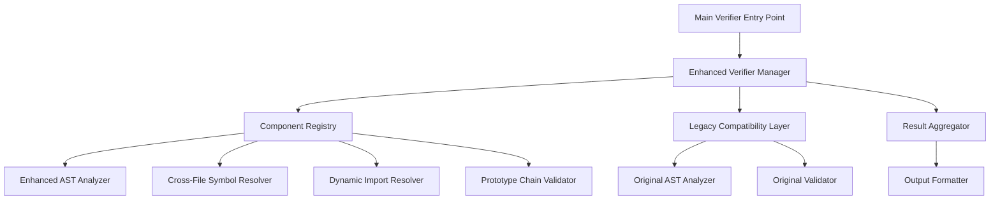

# Integration Strategy for Enhanced Function Implementation Verifier

## Overview

This document outlines the integration strategy for incorporating the enhanced verification components into the existing codebase while maintaining backward compatibility and ensuring a smooth transition.

## Integration Approach

### 1. Incremental Integration Strategy

The enhanced verifier will be integrated incrementally to minimize disruption and allow for continuous validation of improvements.

#### Phase 1: Parallel Implementation

- Keep the existing `verify-function-implementations.js` unchanged
- Implement new components alongside existing ones
- Create a wrapper that can run both versions and compare results
- Use this phase to validate that new components don't introduce regressions

#### Phase 2: Selective Enhancement

- Replace specific components of the existing verifier with enhanced versions
- Start with the highest-impact components first (cross-file symbol resolution)
- Maintain the ability to fall back to original components if needed
- Gradually increase the use of enhanced components

#### Phase 3: Full Replacement

- Once all components are validated and working correctly
- Replace the existing verifier with the enhanced version
- Keep the original as a reference and backup
- Remove old components after a stabilization period

### 2. Backward Compatibility

#### API Compatibility

```javascript
// Maintain the same command-line interface
node scripts/ver-func-impl.js

// Support the same options flags
node scripts/ver-func-impl.js --verbose
node scripts/ver-func-impl.js --output=json
node scripts/ver-func-impl.js --filter=errors
```

#### Output Format Compatibility

```javascript
// Maintain the same violation report structure
{
  type: 'FUNCTION_NOT_FOUND',
  severity: 'error',
  file: 'path/to/file.js',
  line: 42,
  column: 15,
  function: 'unknownFunction',
  message: 'Function unknownFunction() is called but not imported or defined'
}

// Extend with additional fields for enhanced information
{
  type: 'FUNCTION_NOT_FOUND',
  severity: 'error',
  file: 'path/to/file.js',
  line: 42,
  column: 15,
  function: 'unknownFunction',
  message: 'Function unknownFunction() is called but not imported or defined',
  // New fields for enhanced information
  resolution: {
    availableVia: ['dynamic-import'],
    confidence: 0.8,
    sources: ['dynamic-module.js']
  }
}
```

### 3. Component Integration Architecture



#### Enhanced Verifier Manager

```javascript
// scripts/enhanced-verifier-manager.js
export class EnhancedVerifierManager {
  constructor(options = {}) {
    this.options = {
      useEnhancedComponents: options.useEnhancedComponents || {},
      fallbackToLegacy: options.fallbackToLegacy !== false,
      compareResults: options.compareResults || false,
      ...options
    }

    this.componentRegistry = new ComponentRegistry()
    this.legacyCompatibility = new LegacyCompatibilityLayer()
    this.resultAggregator = new ResultAggregator()
  }

  async verify() {
    const results = []

    // Run enhanced components if enabled
    if (Object.keys(this.options.useEnhancedComponents).length > 0) {
      const enhancedResult = await this.runEnhancedVerification()
      results.push({ type: 'enhanced', result: enhancedResult })
    }

    // Run legacy verification for comparison or fallback
    if (this.options.fallbackToLegacy || this.options.compareResults) {
      const legacyResult = await this.runLegacyVerification()
      results.push({ type: 'legacy', result: legacyResult })
    }

    // Aggregate and compare results
    return this.resultAggregator.aggregate(results)
  }
}
```

#### Component Registry

```javascript
// scripts/component-registry.js
export class ComponentRegistry {
  constructor() {
    this.components = new Map()
    this.registerDefaultComponents()
  }

  registerDefaultComponents() {
    this.register('astAnalyzer', {
      enhanced: () => new EnhancedASTAnalyzer(),
      legacy: () => new ASTAnalyzer()
    })

    this.register('symbolResolver', {
      enhanced: () => new SymbolAvailabilityResolver(),
      legacy: null // No legacy equivalent
    })

    this.register('dynamicImportResolver', {
      enhanced: () => new DynamicImportResolver(),
      legacy: null // No legacy equivalent
    })

    this.register('prototypeValidator', {
      enhanced: () => new PrototypeChainValidator(),
      legacy: null // No legacy equivalent
    })
  }

  register(name, implementations) {
    this.components.set(name, implementations)
  }

  get(name, type = 'enhanced') {
    const component = this.components.get(name)
    if (!component) {
      throw new Error(`Component ${name} not found`)
    }

    if (component[type]) {
      return component[type]()
    }

    if (type === 'enhanced' && component.legacy) {
      return component.legacy()
    }

    throw new Error(`Component ${name} ${type} implementation not found`)
  }
}
```

### 4. Configuration Management

#### Configuration File Support

```javascript
// verifier.config.js
export default {
  // Component selection
  components: {
    astAnalyzer: 'enhanced', // 'enhanced' | 'legacy'
    symbolResolver: 'enhanced',
    dynamicImportResolver: 'enhanced',
    prototypeValidator: 'enhanced'
  },

  // Feature flags
  features: {
    crossFileResolution: true,
    dynamicImportAnalysis: true,
    prototypeChainValidation: true,
    methodChainingAnalysis: true
  },

  // Performance settings
  performance: {
    enableCaching: true,
    parallelProcessing: true,
    incrementalAnalysis: true,
    maxWorkers: 4
  },

  // Output settings
  output: {
    format: 'detailed', // 'summary' | 'detailed' | 'json'
    includeResolutions: true,
    includeSuggestions: true,
    groupByFile: true
  },

  // Analysis scope
  scope: {
    include: ['public/**/*.js', 'api/**/*.js'],
    exclude: ['node_modules/**', 'dist/**', 'build/**'],
    followDynamicImports: true
  }
}
```

#### Command Line Interface

```javascript
// scripts/ver-func-impl.js (enhanced version)
#!/usr/bin/env node

import { EnhancedVerifierManager } from './enhanced-verifier-manager.js'
import { loadConfig } from './config-loader.js'

const args = process.argv.slice(2)
const options = parseArgs(args)

// Load configuration
const config = loadConfig(options.config)

// Create verifier manager
const verifier = new EnhancedVerifierManager({
  ...config,
  ...options
})

// Run verification
const result = await verifier.verify()

// Output results
outputResults(result, options.output)
```

### 5. Data Migration and Compatibility

#### Database Schema Evolution

```javascript
// scripts/database-compatibility.js
export class DatabaseCompatibility {
  constructor() {
    this.version = '2.0.0'
    this.migrations = new Map()
    this.registerMigrations()
  }

  registerMigrations() {
    this.migrations.set('1.0.0->2.0.0', {
      up: oldData => this.migrateFrom1_0_0(oldData),
      down: newData => this.migrateTo1_0_0(newData)
    })
  }

  migrateFrom1_0_0(oldData) {
    // Transform old database format to new format
    return {
      ...oldData,
      version: '2.0.0',
      // Add new fields
      scopeInfo: new Map(),
      bindings: new Map(),
      dynamicImports: new Map(),
      // Transform existing data
      imports: this.transformImports(oldData.imports),
      functionCalls: this.transformFunctionCalls(oldData.functionCalls)
    }
  }
}
```

### 6. Error Handling and Recovery

#### Graceful Degradation

```javascript
// scripts/error-handler.js
export class GracefulErrorHandler {
  constructor(options = {}) {
    this.fallbackEnabled = options.fallback !== false
    this.errorLog = []
  }

  async executeWithFallback(operation, fallbackOperation, context) {
    try {
      return await operation()
    } catch (error) {
      this.logError(error, context)

      if (this.fallbackEnabled && fallbackOperation) {
        console.warn(`Enhanced operation failed, falling back to legacy: ${error.message}`)
        return await fallbackOperation()
      }

      throw error
    }
  }

  logError(error, context) {
    this.errorLog.push({
      timestamp: new Date().toISOString(),
      error: error.message,
      stack: error.stack,
      context
    })
  }
}
```

### 7. Performance Monitoring

#### Performance Metrics Collection

```javascript
// scripts/performance-monitor.js
export class PerformanceMonitor {
  constructor() {
    this.metrics = {
      analysisTime: new Map(),
      memoryUsage: new Map(),
      cacheHitRate: new Map(),
      componentPerformance: new Map()
    }
  }

  startTimer(operation) {
    this.metrics.analysisTime.set(operation, {
      start: process.hrtime.bigint(),
      memoryStart: process.memoryUsage()
    })
  }

  endTimer(operation) {
    const timing = this.metrics.analysisTime.get(operation)
    if (!timing) return

    const end = process.hrtime.bigint()
    const memoryEnd = process.memoryUsage()

    this.metrics.analysisTime.set(operation, {
      duration: Number(end - timing.start) / 1000000, // Convert to milliseconds
      memoryDelta: {
        rss: memoryEnd.rss - timing.memoryStart.rss,
        heapUsed: memoryEnd.heapUsed - timing.memoryStart.heapUsed
      }
    })
  }

  getReport() {
    return {
      totalAnalysisTime: this.calculateTotalTime(),
      memoryUsage: this.getMemoryUsage(),
      componentPerformance: this.getComponentPerformance(),
      cachePerformance: this.getCachePerformance()
    }
  }
}
```

### 8. Testing Integration

#### Test Strategy Integration

```javascript
// scripts/integration-test-runner.js
export class IntegrationTestRunner {
  constructor() {
    this.testSuites = new Map()
    this.setupTestSuites()
  }

  setupTestSuites() {
    this.testSuites.set('compatibility', {
      description: 'Test compatibility with existing verifier',
      tests: ['same-violations-detected', 'no-new-false-positives', 'performance-comparison']
    })

    this.testSuites.set('enhancement', {
      description: 'Test enhanced features',
      tests: [
        'dynamic-import-resolution',
        'prototype-chain-validation',
        'cross-file-symbol-resolution'
      ]
    })
  }

  async runTestSuite(suiteName) {
    const suite = this.testSuites.get(suiteName)
    if (!suite) {
      throw new Error(`Test suite ${suiteName} not found`)
    }

    const results = []

    for (const testName of suite.tests) {
      const result = await this.runTest(testName)
      results.push(result)
    }

    return {
      suite: suiteName,
      description: suite.description,
      results,
      passed: results.filter(r => r.passed).length,
      total: results.length
    }
  }
}
```

## Deployment Strategy

### 1. Canary Deployment

#### Gradual Rollout

1. **Stage 1**: Deploy to development environment only
2. **Stage 2**: Enable for specific test directories
3. **Stage 3**: Enable for specific file patterns
4. **Stage 4**: Full deployment with rollback capability

#### Feature Flags

```javascript
// scripts/feature-flags.js
export const FEATURE_FLAGS = {
  ENHANCED_AST_ANALYSIS: process.env.VERIFIER_ENHANCED_AST === 'true',
  CROSS_FILE_RESOLUTION: process.env.VERIFIER_CROSS_FILE === 'true',
  DYNAMIC_IMPORT_ANALYSIS: process.env.VERIFIER_DYNAMIC_IMPORT === 'true',
  PROTOTYPE_CHAIN_VALIDATION: process.env.VERIFIER_PROTOTYPE_CHAIN === 'true'
}
```

### 2. Monitoring and Alerting

#### Health Checks

```javascript
// scripts/health-check.js
export class HealthCheck {
  async checkSystem() {
    const checks = [
      this.checkMemoryUsage(),
      this.checkPerformance(),
      this.checkAccuracy(),
      this.checkComponentHealth()
    ]

    const results = await Promise.allSettled(checks)

    return {
      healthy: results.every(r => r.status === 'fulfilled' && r.value.healthy),
      checks: results.map(r =>
        r.status === 'fulfilled'
          ? r.value
          : {
              healthy: false,
              error: r.reason
            }
      )
    }
  }
}
```

### 3. Rollback Strategy

#### Automatic Rollback Triggers

1. **Accuracy Degradation**: If false positives increase beyond threshold
2. **Performance Degradation**: If analysis time increases beyond threshold
3. **Error Rate**: If error rate exceeds threshold
4. **Memory Usage**: If memory usage exceeds limits

#### Manual Rollback

```bash
# Rollback to previous version
export VERIFIER_USE_ENHANCED=false
node scripts/ver-func-impl.js

# Or use configuration
node scripts/ver-func-impl.js --config=verifier-legacy.config.js
```

## Success Criteria

### 1. Functional Success

- [ ] All existing functionality preserved
- [ ] Zero false negatives (missing actual violations)
- [ ] 90% reduction in false positives
- [ ] Support for all new patterns (dynamic imports, prototype chains, etc.)

### 2. Performance Success

- [ ] Analysis time within 110% of original
- [ ] Memory usage within 120% of original
- [ ] Incremental analysis working correctly
- [ ] Parallel processing providing expected speedup

### 3. Integration Success

- [ ] Seamless integration with existing CI/CD
- [ ] Backward compatibility maintained
- [ ] Configuration system working
- [ ] Error handling and recovery functioning

### 4. Operational Success

- [ ] Monitoring and alerting functional
- [ ] Health checks passing
- [ ] Documentation complete
- [ ] Team training completed

## Risk Mitigation

### 1. Technical Risks

- **Complexity**: Managed through modular design and comprehensive testing
- **Performance**: Continuous monitoring and optimization
- **Compatibility**: Maintained through compatibility layer and feature flags
- **Reliability**: Error handling and graceful degradation

### 2. Operational Risks

- **Deployment Disruption**: Canary deployment and rollback capability
- **Team Adoption**: Comprehensive documentation and training
- **Maintenance**: Clear code structure and documentation
- **Support**: Monitoring and alerting systems

This integration strategy ensures a smooth transition to the enhanced verifier while maintaining system stability and providing operational confidence.
