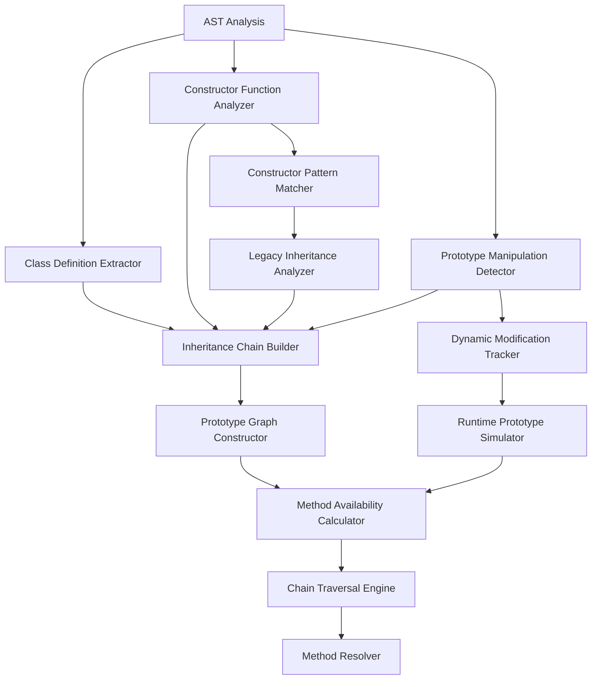

# Prototype Chain Method Validation Design

## Overview

The Prototype Chain Method Validation component is designed to properly validate methods available through JavaScript's prototype-based inheritance system. This addresses the current limitation where only immediate prototype methods are checked, missing inherited methods from deeper prototype chains.

## JavaScript Prototype System Analysis

### Prototype Chain Patterns

```javascript
// 1. Classical inheritance
class Animal {
  speak() {
    console.log('Animal speaks')
  }
}

class Dog extends Animal {
  bark() {
    console.log('Dog barks')
  }
}

const dog = new Dog()
dog.speak() // Inherited from Animal
dog.bark() // Defined on Dog

// 2. Constructor function inheritance
function Vehicle(name) {
  this.name = name
}

Vehicle.prototype.start = function () {
  console.log(`${this.name} started`)
}

function Car(name, brand) {
  Vehicle.call(this, name)
  this.brand = brand
}

Car.prototype = Object.create(Vehicle.prototype)
Car.prototype.constructor = Car
Car.prototype.drive = function () {
  console.log(`${this.brand} ${this.name} is driving`)
}

// 3. Mixin patterns
const CanFly = {
  fly() {
    console.log('Flying')
  }
}

const CanSwim = {
  swim() {
    console.log('Swimming')
  }
}

function Duck(name) {
  this.name = name
}

Object.assign(Duck.prototype, CanFly, CanSwim)

// 4. Dynamic prototype modification
Array.prototype.customMethod = function () {
  console.log('Custom array method')
}

// 5. Object.create with custom prototype
const personPrototype = {
  greet() {
    console.log('Hello')
  }
}

const person = Object.create(personPrototype)
person.name = 'John'

// 6. Prototype chain traversal
function getMethodChain(obj, methodName) {
  const chain = []
  let current = obj

  while (current) {
    if (current[methodName]) {
      chain.push({
        object: current,
        method: current[methodName],
        level: chain.length
      })
    }
    current = Object.getPrototypeOf(current)
  }

  return chain
}
```

## Core Architecture

### Prototype Chain Analysis Pipeline



## Class Definition Analysis

### ES6 Class Analyzer

```javascript
class ClassDefinitionAnalyzer {
  constructor() {
    this.classDefinitions = new Map() // className -> ClassInfo
    this.inheritanceChains = new Map() // className -> inheritanceChain
    this.mixins = new Map() // className -> mixin[]
  }

  analyzeClassDefinitions(ast, filePath) {
    const classes = []

    this.traverse(ast, {
      ClassDeclaration: node => {
        const classInfo = this.analyzeClassDeclaration(node, filePath)
        classes.push(classInfo)
        this.classDefinitions.set(classInfo.name, classInfo)
      },

      ClassExpression: node => {
        const classInfo = this.analyzeClassExpression(node, filePath)
        classes.push(classInfo)

        if (classInfo.name) {
          this.classDefinitions.set(classInfo.name, classInfo)
        }
      }
    })

    // Build inheritance chains after all classes are identified
    this.buildInheritanceChains()

    return classes
  }

  analyzeClassDeclaration(node, filePath) {
    const classInfo = {
      name: node.id.name,
      type: 'class',
      filePath,
      node,
      superClass: null,
      methods: [],
      properties: [],
      staticMethods: [],
      staticProperties: [],
      constructor: null,
      mixins: []
    }

    // Analyze superclass
    if (node.superClass) {
      classInfo.superClass = this.analyzeSuperClass(node.superClass)
    }

    // Analyze class body
    node.body.body.forEach(member => {
      this.analyzeClassMember(member, classInfo)
    })

    return classInfo
  }

  analyzeClassMember(member, classInfo) {
    if (member.type === 'MethodDefinition') {
      const methodInfo = {
        name: member.key.name,
        type: member.kind, // 'method', 'get', 'set', 'constructor'
        isStatic: member.static,
        isAsync: member.value.async,
        isGenerator: member.value.generator,
        node: member
      }

      if (member.kind === 'constructor') {
        classInfo.constructor = methodInfo
      } else if (member.static) {
        classInfo.staticMethods.push(methodInfo)
      } else {
        classInfo.methods.push(methodInfo)
      }
    } else if (member.type === 'PropertyDefinition') {
      const propInfo = {
        name: member.key.name,
        isStatic: member.static,
        node: member
      }

      if (member.static) {
        classInfo.staticProperties.push(propInfo)
      } else {
        classInfo.properties.push(propInfo)
      }
    }
  }

  analyzeSuperClass(superClassNode) {
    if (superClassNode.type === 'Identifier') {
      return {
        type: 'identifier',
        name: superClassNode.name,
        resolvable: true
      }
    } else if (superClassNode.type === 'MemberExpression') {
      return {
        type: 'member-expression',
        expression: this.analyzeMemberExpression(superClassNode),
        resolvable: false
      }
    } else if (superClassNode.type === 'CallExpression') {
      return {
        type: 'expression',
        expression: superClassNode,
        resolvable: false
      }
    }

    return null
  }

  buildInheritanceChains() {
    this.classDefinitions.forEach((classInfo, className) => {
      const chain = this.buildInheritanceChain(classInfo)
      this.inheritanceChains.set(className, chain)
    })
  }

  buildInheritanceChain(classInfo, visited = new Set()) {
    if (visited.has(classInfo.name)) {
      // Circular inheritance detected
      return []
    }

    visited.add(classInfo.name)
    const chain = [classInfo]

    if (classInfo.superClass && classInfo.superClass.resolvable) {
      const superClass = this.classDefinitions.get(classInfo.superClass.name)
      if (superClass) {
        const parentChain = this.buildInheritanceChain(superClass, visited)
        chain.push(...parentChain)
      }
    }

    return chain
  }
}
```

## Constructor Function Analysis

### Legacy Inheritance Analyzer

```javascript
class ConstructorFunctionAnalyzer {
  constructor() {
    this.constructors = new Map() // constructorName -> ConstructorInfo
    this.prototypeAssignments = new Map() // constructorName -> prototypeAssignments[]
    this.inheritancePatterns = new Map() // constructorName -> inheritancePattern
  }

  analyzeConstructorFunctions(ast, filePath) {
    const constructors = []

    this.traverse(ast, {
      FunctionDeclaration: node => {
        if (this.isConstructorFunction(node)) {
          const constructorInfo = this.analyzeConstructorFunction(node, filePath)
          constructors.push(constructorInfo)
          this.constructors.set(constructorInfo.name, constructorInfo)
        }
      },

      AssignmentExpression: node => {
        if (this.isPrototypeAssignment(node)) {
          const assignmentInfo = this.analyzePrototypeAssignment(node, filePath)
          this.addPrototypeAssignment(assignmentInfo)
        }
      }
    })

    // Analyze inheritance patterns
    this.analyzeInheritancePatterns()

    return constructors
  }

  isConstructorFunction(node) {
    // Heuristics to identify constructor functions
    return (
      node.id &&
      node.id.name &&
      node.id.name[0] === node.id.name[0].toUpperCase() && // PascalCase
      node.params.length > 0
    )
  }

  analyzeConstructorFunction(node, filePath) {
    const constructorInfo = {
      name: node.id.name,
      type: 'constructor',
      filePath,
      node,
      parameters: node.params.map(param => ({
        name: param.name,
        type: param.type
      })),
      thisAssignments: [],
      prototypeMethods: []
    }

    // Analyze function body for this assignments
    this.traverse(node.body, {
      AssignmentExpression: assignmentNode => {
        if (this.isThisAssignment(assignmentNode)) {
          constructorInfo.thisAssignments.push({
            property: this.getThisProperty(assignmentNode),
            node: assignmentNode
          })
        }
      }
    })

    return constructorInfo
  }

  isPrototypeAssignment(node) {
    return (
      node.left &&
      node.left.type === 'MemberExpression' &&
      node.left.object.type === 'MemberExpression' &&
      node.left.object.property &&
      node.left.object.property.name === 'prototype'
    )
  }

  analyzePrototypeAssignment(node, filePath) {
    const constructorName = node.left.object.object.name
    const methodName = node.left.property.name

    return {
      constructorName,
      methodName,
      value: node.right,
      node,
      filePath,
      type: this.getAssignmentType(node.right)
    }
  }

  addPrototypeAssignment(assignmentInfo) {
    if (!this.prototypeAssignments.has(assignmentInfo.constructorName)) {
      this.prototypeAssignments.set(assignmentInfo.constructorName, [])
    }

    this.prototypeAssignments.get(assignmentInfo.constructorName).push(assignmentInfo)

    // Also add to the constructor info if it exists
    const constructor = this.constructors.get(assignmentInfo.constructorName)
    if (constructor) {
      constructor.prototypeMethods.push({
        name: assignmentInfo.methodName,
        node: assignmentInfo.node,
        type: assignmentInfo.type
      })
    }
  }

  analyzeInheritancePatterns() {
    this.constructors.forEach((constructor, name) => {
      const pattern = this.detectInheritancePattern(constructor)
      if (pattern) {
        this.inheritancePatterns.set(name, pattern)
      }
    })
  }

  detectInheritancePattern(constructor) {
    // Look for common inheritance patterns

    // Pattern 1: Constructor.prototype = new ParentConstructor()
    const prototypeNewPattern = this.findPrototypeNewPattern(constructor)
    if (prototypeNewPattern) {
      return {
        type: 'prototype-new',
        parentConstructor: prototypeNewPattern.parentName,
        chain: this.buildConstructorChain(prototypeNewPattern.parentName)
      }
    }

    // Pattern 2: Constructor.prototype = Object.create(ParentConstructor.prototype)
    const objectCreatePattern = this.findObjectCreatePattern(constructor)
    if (objectCreatePattern) {
      return {
        type: 'object-create',
        parentConstructor: objectCreatePattern.parentName,
        chain: this.buildConstructorChain(objectCreatePattern.parentName)
      }
    }

    // Pattern 3: Util.inherits(Constructor, ParentConstructor)
    const utilInheritsPattern = this.findUtilInheritsPattern(constructor)
    if (utilInheritsPattern) {
      return {
        type: 'util-inherits',
        parentConstructor: utilInheritsPattern.parentName,
        chain: this.buildConstructorChain(utilInheritsPattern.parentName)
      }
    }

    return null
  }
}
```

## Prototype Chain Traversal

### Chain Walker

```javascript
class PrototypeChainWalker {
  constructor(classAnalyzer, constructorAnalyzer) {
    this.classAnalyzer = classAnalyzer
    this.constructorAnalyzer = constructorAnalyzer
    this.prototypeGraph = new Map() // objectName -> PrototypeNode
    this.builtInPrototypes = this.initializeBuiltInPrototypes()
  }

  buildPrototypeGraph() {
    // Add built-in prototypes
    this.addBuiltInPrototypes()

    // Add class-based prototypes
    this.addClassPrototypes()

    // Add constructor function prototypes
    this.addConstructorPrototypes()

    // Add dynamic prototype modifications
    this.addDynamicModifications()
  }

  addClassPrototypes() {
    this.classAnalyzer.classDefinitions.forEach((classInfo, className) => {
      const node = this.createPrototypeNode(className, 'class', classInfo)
      this.prototypeGraph.set(className, node)

      // Set up inheritance relationships
      const inheritanceChain = this.classAnalyzer.inheritanceChains.get(className)
      if (inheritanceChain && inheritanceChain.length > 1) {
        const parentClass = inheritanceChain[1]
        node.parent = parentClass.name
      }
    })
  }

  addConstructorPrototypes() {
    this.constructorAnalyzer.constructors.forEach((constructor, name) => {
      const node = this.createPrototypeNode(name, 'constructor', constructor)
      this.prototypeGraph.set(name, node)

      // Set up inheritance relationships
      const pattern = this.constructorAnalyzer.inheritancePatterns.get(name)
      if (pattern) {
        node.parent = pattern.parentConstructor
      }
    })
  }

  createPrototypeNode(name, type, info) {
    const node = {
      name,
      type, // 'class', 'constructor', 'builtin', 'dynamic'
      info,
      parent: null,
      children: new Set(),
      methods: new Map(),
      properties: new Map(),
      staticMethods: new Map(),
      staticProperties: new Map()
    }

    // Extract methods based on type
    if (type === 'class') {
      this.extractClassMethods(node, info)
    } else if (type === 'constructor') {
      this.extractConstructorMethods(node, info)
    }

    return node
  }

  extractClassMethods(node, classInfo) {
    // Instance methods
    classInfo.methods.forEach(method => {
      node.methods.set(method.name, {
        name: method.name,
        source: classInfo.filePath,
        node: method.node,
        isAsync: method.isAsync,
        isGenerator: method.isGenerator,
        type: method.type
      })
    })

    // Static methods
    classInfo.staticMethods.forEach(method => {
      node.staticMethods.set(method.name, {
        name: method.name,
        source: classInfo.filePath,
        node: method.node,
        isAsync: method.isAsync,
        isGenerator: method.isGenerator,
        type: method.type
      })
    })
  }

  extractConstructorMethods(node, constructorInfo) {
    // Prototype methods
    constructorInfo.prototypeMethods.forEach(method => {
      node.methods.set(method.name, {
        name: method.name,
        source: constructorInfo.filePath,
        node: method.node,
        type: method.type
      })
    })
  }

  walkPrototypeChain(objectName) {
    const chain = []
    let current = this.prototypeGraph.get(objectName)

    while (current) {
      chain.push(current)

      // Move to parent prototype
      if (current.parent) {
        current = this.prototypeGraph.get(current.parent)
      } else if (current.type === 'class' || current.type === 'constructor') {
        // Fall back to built-in prototypes
        current = this.getBuiltInPrototype(current.type)
      } else {
        current = null
      }
    }

    return chain
  }

  isMethodAvailable(objectName, methodName) {
    const chain = this.walkPrototypeChain(objectName)

    for (const prototype of chain) {
      if (prototype.methods.has(methodName)) {
        return {
          available: true,
          source: prototype.name,
          method: prototype.methods.get(methodName),
          level: chain.indexOf(prototype)
        }
      }
    }

    return {
      available: false,
      reason: `Method '${methodName}' not found in prototype chain of '${objectName}'`
    }
  }

  getAllAvailableMethods(objectName) {
    const chain = this.walkPrototypeChain(objectName)
    const methods = new Map()

    chain.forEach((prototype, level) => {
      prototype.methods.forEach((method, name) => {
        if (!methods.has(name)) {
          methods.set(name, {
            name,
            source: prototype.name,
            level,
            method,
            sourceType: prototype.type
          })
        }
      })
    })

    return methods
  }
}
```

## Dynamic Prototype Modification

### Runtime Prototype Tracker

```javascript
class DynamicPrototypeTracker {
  constructor() {
    this.modifications = new Map() // filePath -> PrototypeModification[]
    this.runtimeSimulations = new Map() // objectName -> RuntimeState
  }

  detectPrototypeModifications(ast, filePath) {
    const modifications = []

    this.traverse(ast, {
      AssignmentExpression: node => {
        if (this.isPrototypeModification(node)) {
          const modification = this.analyzePrototypeModification(node, filePath)
          modifications.push(modification)
        }
      },

      CallExpression: node => {
        if (this.isPrototypeManipulation(node)) {
          const manipulation = this.analyzePrototypeManipulation(node, filePath)
          modifications.push(manipulation)
        }
      }
    })

    this.modifications.set(filePath, modifications)
    return modifications
  }

  isPrototypeModification(node) {
    return (
      node.left &&
      node.left.type === 'MemberExpression' &&
      (this.isDirectPrototypeAccess(node.left) || this.isObjectPrototypeAccess(node.left))
    )
  }

  isDirectPrototypeAccess(node) {
    return node.object.type === 'MemberExpression' && node.object.property.name === 'prototype'
  }

  isObjectPrototypeAccess(node) {
    return (
      node.object.type === 'Identifier' &&
      node.object.name === 'Object' &&
      node.property.name === 'prototype'
    )
  }

  analyzePrototypeModification(node, filePath) {
    let targetObject = null
    let propertyName = null
    let modificationType = null

    if (this.isDirectPrototypeAccess(node.left)) {
      // Constructor.prototype.method = function() {}
      targetObject = node.left.object.object.name
      propertyName = node.left.property.name
      modificationType = 'prototype-method'
    } else if (this.isObjectPrototypeAccess(node.left)) {
      // Object.prototype.method = function() {}
      targetObject = 'Object'
      propertyName = node.left.property.name
      modificationType = 'builtin-prototype'
    }

    return {
      type: modificationType,
      targetObject,
      propertyName,
      value: node.right,
      node,
      filePath,
      isConditional: this.isInConditionalContext(node),
      context: this.extractContext(node)
    }
  }

  simulateRuntimeModifications() {
    // Apply all detected modifications to create runtime state
    const runtimeState = new Map()

    // Start with built-in prototypes
    this.initializeBuiltInPrototypes(runtimeState)

    // Apply modifications in order
    this.modifications.forEach((modifications, filePath) => {
      modifications.forEach(modification => {
        this.applyModification(runtimeState, modification)
      })
    })

    this.runtimeSimulations = runtimeState
    return runtimeState
  }

  applyModification(runtimeState, modification) {
    const targetState = runtimeState.get(modification.targetObject)

    if (!targetState) {
      // Create new object state
      runtimeState.set(modification.targetObject, {
        methods: new Map(),
        properties: new Map()
      })
    }

    const state = runtimeState.get(modification.targetObject)

    if (modification.type === 'prototype-method') {
      // Add method to prototype
      state.methods.set(modification.propertyName, {
        name: modification.propertyName,
        source: modification.filePath,
        node: modification.node,
        isDynamic: true
      })
    }
  }

  getEnhancedPrototypeChain(objectName) {
    // Get base prototype chain
    const baseChain = this.walkPrototypeChain(objectName)

    // Enhance with runtime modifications
    const enhancedChain = baseChain.map(prototype => {
      const runtimeState = this.runtimeSimulations.get(prototype.name)

      if (runtimeState) {
        // Merge runtime methods with existing methods
        const enhancedMethods = new Map(prototype.methods)

        runtimeState.methods.forEach((method, name) => {
          if (!enhancedMethods.has(name)) {
            enhancedMethods.set(name, method)
          }
        })

        return {
          ...prototype,
          methods: enhancedMethods,
          hasDynamicModifications: true
        }
      }

      return prototype
    })

    return enhancedChain
  }
}
```

## Integration with Existing Verifier

### Enhanced Method Validation

```javascript
class EnhancedPrototypeMethodValidator {
  constructor(prototypeWalker, dynamicTracker) {
    this.prototypeWalker = prototypeWalker
    this.dynamicTracker = dynamicTracker
    this.validationCache = new Map()
  }

  validateMethodCall(objectName, methodName, filePath, line, col, db) {
    const cacheKey = `${objectName}:${methodName}:${filePath}`

    if (this.validationCache.has(cacheKey)) {
      const cached = this.validationCache.get(cacheKey)
      if (cached.available) {
        return true // Method is valid
      } else {
        this.addViolation(db, cached, filePath, line, col)
        return false
      }
    }

    // Simulate runtime modifications first
    this.dynamicTracker.simulateRuntimeModifications()

    // Get enhanced prototype chain
    const chain = this.dynamicTracker.getEnhancedPrototypeChain(objectName)

    // Check method availability
    const methodCheck = this.checkMethodInChain(chain, methodName)

    // Cache the result
    this.validationCache.set(cacheKey, methodCheck)

    if (!methodCheck.available) {
      this.addViolation(db, methodCheck, filePath, line, col)
      return false
    }

    return true
  }

  checkMethodInChain(chain, methodName) {
    for (const prototype of chain) {
      if (prototype.methods.has(methodName)) {
        const method = prototype.methods.get(methodName)

        return {
          available: true,
          source: prototype.name,
          level: chain.indexOf(prototype),
          method,
          isDynamic: method.isDynamic || false,
          sourceType: prototype.type
        }
      }
    }

    return {
      available: false,
      reason: `Method '${methodName}' not found in prototype chain`,
      chainLength: chain.length,
      availableMethods: Array.from(chain[0]?.methods.keys() || [])
    }
  }

  addViolation(db, methodCheck, filePath, line, col) {
    db.addViolation({
      type: 'METHOD_NOT_FOUND_IN_PROTOTYPE',
      severity: 'error',
      file: filePath,
      line,
      column: col,
      method: methodCheck.methodName || 'unknown',
      object: methodCheck.objectName || 'unknown',
      reason: methodCheck.reason,
      availableMethods: methodCheck.availableMethods?.slice(0, 5) || [],
      suggestion: this.generateSuggestion(methodCheck)
    })
  }

  generateSuggestion(methodCheck) {
    if (!methodCheck.availableMethods || methodCheck.availableMethods.length === 0) {
      return null
    }

    // Find similar method names
    const available = methodCheck.availableMethods
    const target = methodCheck.methodName

    const similar = available.find(name => this.stringSimilarity(name, target) > 0.7)

    if (similar) {
      return `Did you mean '${similar}'?`
    }

    return `Available methods: ${available.slice(0, 3).join(', ')}`
  }

  stringSimilarity(str1, str2) {
    // Simple Levenshtein distance-based similarity
    const longer = str1.length > str2.length ? str1 : str2
    const shorter = str1.length > str2.length ? str2 : str1

    if (longer.length === 0) {
      return 1.0
    }

    const distance = this.levenshteinDistance(longer, shorter)
    return (longer.length - distance) / longer.length
  }

  levenshteinDistance(str1, str2) {
    const matrix = []

    for (let i = 0; i <= str2.length; i++) {
      matrix[i] = [i]
    }

    for (let j = 0; j <= str1.length; j++) {
      matrix[0][j] = j
    }

    for (let i = 1; i <= str2.length; i++) {
      for (let j = 1; j <= str1.length; j++) {
        if (str2.charAt(i - 1) === str1.charAt(j - 1)) {
          matrix[i][j] = matrix[i - 1][j - 1]
        } else {
          matrix[i][j] = Math.min(
            matrix[i - 1][j - 1] + 1,
            matrix[i][j - 1] + 1,
            matrix[i - 1][j] + 1
          )
        }
      }
    }

    return matrix[str2.length][str1.length]
  }
}
```

## Expected Improvements

1. **Complete prototype chain validation**: Check entire inheritance hierarchy, not just immediate prototype
2. **Support for ES6 classes**: Properly handle class-based inheritance
3. **Legacy constructor support**: Handle constructor function inheritance patterns
4. **Dynamic prototype modification**: Track and validate runtime prototype changes
5. **Mixin pattern support**: Understand and validate object composition patterns
6. **Built-in prototype awareness**: Know about built-in object methods and properties
7. **Accurate method source tracking**: Know exactly where each method comes from in the chain
8. **Better error messages**: Provide helpful suggestions when methods are not found

This Prototype Chain Method Validation component provides comprehensive validation of JavaScript's prototype-based inheritance system, significantly reducing false positives related to inherited methods and improving overall verification accuracy.
