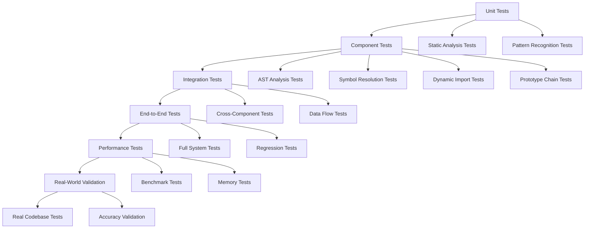

# Testing and Validation Approach for Enhanced Function Implementation Verifier

## Overview

This document outlines a comprehensive testing and validation approach to ensure the enhanced function implementation verifier achieves 100% accuracy without introducing regressions. The testing strategy covers unit testing, integration testing, performance testing, and real-world validation.

## Testing Strategy

### 1. Multi-Layer Testing Architecture



### 2. Test Categories

#### 2.1 Unit Tests

**Purpose**: Test individual components in isolation

**Coverage Requirements**:

- 100% line coverage for all components
- 100% branch coverage for critical paths
- 95%+ statement coverage overall

**Test Structure**:

```
tests/unit/
├── ast-analyzer.test.js
├── scope-analyzer.test.js
├── binding-resolver.test.js
├── pattern-recognizer.test.js
├── import-export-collector.test.js
├── module-graph-builder.test.js
├── symbol-table-constructor.test.js
├── symbol-availability-resolver.test.js
├── dynamic-import-detector.test.js
├── dynamic-path-evaluator.test.js
├── conditional-import-analyzer.test.js
├── dynamic-import-simulator.test.js
├── class-definition-analyzer.test.js
├── constructor-function-analyzer.test.js
├── prototype-chain-walker.test.js
└── dynamic-prototype-tracker.test.js
```

**Example Unit Test**:

```javascript
// tests/unit/symbol-availability-resolver.test.js
import { describe, it, expect, beforeEach } from 'vitest'
import { SymbolAvailabilityResolver } from '../../scripts/symbol-availability-resolver.js'

describe('SymbolAvailabilityResolver', () => {
  let resolver
  let mockSymbolTables
  let mockModuleGraph

  beforeEach(() => {
    mockSymbolTables = createMockSymbolTables()
    mockModuleGraph = createMockModuleGraph()
    resolver = new SymbolAvailabilityResolver(mockSymbolTables, mockModuleGraph)
  })

  describe('isSymbolAvailable', () => {
    it('should resolve locally defined symbols', () => {
      const result = resolver.isSymbolAvailable('localFunction', '/test/file.js')

      expect(result.available).toBe(true)
      expect(result.source).toBe('local')
      expect(result.type).toBe('function')
    })

    it('should resolve imported symbols', () => {
      const result = resolver.isSymbolAvailable('importedFunction', '/test/file.js')

      expect(result.available).toBe(true)
      expect(result.source).toBe('import')
      expect(result.symbol.filePath).toBe('/test/source.js')
    })

    it('should resolve global symbols', () => {
      const result = resolver.isSymbolAvailable('console', '/test/file.js')

      expect(result.available).toBe(true)
      expect(result.source).toBe('global')
      expect(result.type).toBe('builtin')
    })

    it('should return unavailable for unknown symbols', () => {
      const result = resolver.isSymbolAvailable('unknownFunction', '/test/file.js')

      expect(result.available).toBe(false)
      expect(result.reason).toContain('not found')
    })
  })
})
```

#### 2.2 Component Tests

**Purpose**: Test components with their dependencies mocked

**Key Test Scenarios**:

```javascript
// tests/component/ast-analyzer-component.test.js
import { describe, it, expect, beforeEach } from 'vitest'
import { EnhancedASTAnalyzer } from '../../scripts/enhanced-ast-analyzer.js'
import { ScopeAnalyzer } from '../../scripts/scope-analyzer.js'
import { BindingResolver } from '../../scripts/binding-resolver.js'

describe('EnhancedASTAnalyzer Component Tests', () => {
  let analyzer
  let mockDB

  beforeEach(() => {
    mockDB = createMockDatabase()
    analyzer = new EnhancedASTAnalyzer(mockDB)
  })

  describe('analyzeFile with complex patterns', () => {
    it('should analyze dynamic method access patterns', async () => {
      const code = `
        const obj = { method: () => {} }
        const methodName = 'method'
        obj[methodName]()
      `

      await analyzer.analyzeFile('/test/dynamic.js', code)

      const dynamicCalls = mockDB.getDynamicMemberCalls('/test/dynamic.js')
      expect(dynamicCalls).toHaveLength(1)
      expect(dynamicCalls[0].method).toBe('method')
      expect(dynamicCalls[0].isDynamic).toBe(true)
    })

    it('should analyze method chaining patterns', async () => {
      const code = `
        api.getProducts()
          .then(res => res.data)
          .filter(item => item.active)
      `

      await analyzer.analyzeFile('/test/chaining.js', code)

      const chains = mockDB.getMethodChains('/test/chaining.js')
      expect(chains).toHaveLength(1)
      expect(chains[0].methods).toEqual(['getProducts', 'then', 'filter'])
    })
  })
})
```

#### 2.3 Integration Tests

**Purpose**: Test how components work together

**Test Categories**:

- Cross-file symbol resolution
- Dynamic import resolution with path evaluation
- Prototype chain validation with inheritance
- End-to-end analysis workflows

```javascript
// tests/integration/cross-file-resolution.test.js
import { describe, it, expect, beforeEach, afterEach } from 'vitest'
import { createTestEnvironment } from '../helpers/test-environment.js'

describe('Cross-File Symbol Resolution Integration', () => {
  let testEnv

  beforeEach(async () => {
    testEnv = await createTestEnvironment({
      files: {
        '/module1.js': `
          export function exportedFunction() {}
          export const exportedConst = 'value'
        `,
        '/module2.js': `
          import { exportedFunction } from './module1.js'
          import * as module1 from './module1.js'
          
          function localFunction() {
            exportedFunction()
            module1.exportedConst
          }
        `,
        '/dynamic.js': `
          async function loadModule() {
            const module = await import('./module1.js')
            module.exportedFunction()
          }
        `
      }
    })
  })

  afterEach(() => {
    testEnv.cleanup()
  })

  it('should resolve symbols across imported modules', async () => {
    const result = await testEnv.analyze('/module2.js')

    expect(result.violations).toHaveLength(0)
    expect(result.resolutions).toContainEqual({
      symbol: 'exportedFunction',
      source: 'import',
      filePath: '/module1.js'
    })
  })

  it('should resolve symbols from namespace imports', async () => {
    const result = await testEnv.analyze('/module2.js')

    expect(result.violations).toHaveLength(0)
    expect(result.resolutions).toContainEqual({
      symbol: 'exportedConst',
      source: 'namespace-import',
      filePath: '/module1.js'
    })
  })

  it('should resolve symbols from dynamic imports', async () => {
    const result = await testEnv.analyze('/dynamic.js')

    expect(result.violations).toHaveLength(0)
    expect(result.resolutions).toContainEqual({
      symbol: 'exportedFunction',
      source: 'dynamic-import',
      filePath: '/module1.js',
      confidence: expect.any(Number)
    })
  })
})
```

### 3. Test Case Design

#### 3.1 Real-World Test Cases

**Dynamic Import Patterns**:

```javascript
// test-cases/dynamic-imports/basic-dynamic-import.js
// Should resolve: the module is statically determinable
const module = await import('./utils.js')
module.helperFunction()

// test-cases/dynamic-imports/conditional-dynamic-import.js
// Should resolve: conditional but deterministic
if (process.env.NODE_ENV === 'development') {
  const devTools = await import('./dev-tools.js')
  devTools.enable()
}

// test-cases/dynamic-imports/computed-path.js
// Should attempt resolution: template literal with variable
const theme = await import(`./themes/${config.theme}.js`)
theme.apply()

// test-cases/dynamic-imports/fully-dynamic.js
// Should not resolve: completely dynamic path
const moduleName = getModuleName()
const module = await import(moduleName)
module.someFunction()
```

**Prototype Chain Patterns**:

```javascript
// test-cases/prototype-chains/es6-classes.js
class Animal {
  speak() {
    console.log('Animal speaks')
  }
}

class Dog extends Animal {
  bark() {
    console.log('Dog barks')
  }
}

const dog = new Dog()
dog.speak() // Should resolve: inherited from Animal
dog.bark() // Should resolve: defined on Dog

// test-cases/prototype-chains/constructor-inheritance.js
function Vehicle(name) {
  this.name = name
}

Vehicle.prototype.start = function () {
  console.log(`${this.name} started`)
}

function Car(name, brand) {
  Vehicle.call(this, name)
  this.brand = brand
}

Car.prototype = Object.create(Vehicle.prototype)
Car.prototype.constructor = Car
Car.prototype.drive = function () {
  console.log(`${this.brand} ${this.name} is driving`)
}

const car = new Car('Model T', 'Ford')
car.start() // Should resolve: inherited from Vehicle
car.drive() // Should resolve: defined on Car

// test-cases/prototype-chains/mixin-patterns.js
const CanFly = {
  fly() {
    console.log('Flying')
  }
}

const CanSwim = {
  swim() {
    console.log('Swimming')
  }
}

function Duck(name) {
  this.name = name
}

Object.assign(Duck.prototype, CanFly, CanSwim)

const duck = new Duck()
duck.fly() // Should resolve: from mixin
duck.swim() // Should resolve: from mixin
```

**Cross-File Symbol Patterns**:

```javascript
// test-cases/cross-file-symbols/re-exports.js
// utils.js
export function helper() {}
export const CONSTANT = 'value'

// re-export.js
export { helper, CONSTANT } from './utils.js'
export { default as DefaultExport } from './utils.js'

// consumer.js
import { helper, CONSTANT } from './re-export.js'
import DefaultExport from './re-export.js'

helper() // Should resolve: through re-export
CONSTANT // Should resolve: through re-export
DefaultExport() // Should resolve: through re-export
```

#### 3.2 Edge Cases and Error Conditions

```javascript
// test-cases/edge-cases/circular-dependencies.js
// module-a.js
import { b } from './module-b.js'
export function a() {
  b()
}

// module-b.js
import { a } from './module-a.js'
export function b() {
  a()
}

// test-cases/edge-cycles/self-reference.js
function self() {
  self() // Should not flag as violation
}

// test-cases/edge-cases/conditional-declarations.js
if (someCondition) {
  function conditionalFunction() {}
}

conditionalFunction() // Should resolve: function hoisting

// test-cases/edge-cases/dynamic-prototype-modification.js
Array.prototype.customMethod = function () {
  console.log('Custom method')
}

const arr = []
arr.customMethod() // Should resolve: dynamic prototype modification
```

### 4. Performance Testing

#### 4.1 Benchmark Suite

```javascript
// tests/performance/benchmark.test.js
import { describe, it, expect } from 'vitest'
import { performance } from 'perf_hooks'
import { EnhancedFunctionVerifier } from '../../scripts/ver-func-impl.js'

describe('Performance Benchmarks', () => {
  const testCases = [
    {
      name: 'Small Project',
      fileCount: 10,
      linesOfCode: 1000,
      expectedTime: 1000 // ms
    },
    {
      name: 'Medium Project',
      fileCount: 100,
      linesOfCode: 10000,
      expectedTime: 5000 // ms
    },
    {
      name: 'Large Project',
      fileCount: 1000,
      linesOfCode: 100000,
      expectedTime: 30000 // ms
    }
  ]

  testCases.forEach(testCase => {
    it(`should analyze ${testCase.name} within ${testCase.expectedTime}ms`, async () => {
      const testEnv = await createTestEnvironment({
        fileCount: testCase.fileCount,
        linesPerFile: testCase.linesOfCode / testCase.fileCount
      })

      const start = performance.now()
      const result = await testEnv.analyzeAll()
      const end = performance.now()

      const duration = end - start

      expect(duration).toBeLessThan(testCase.expectedTime)
      expect(result.violations).toBeDefined()
      expect(result.statistics.filesAnalyzed).toBe(testCase.fileCount)
    })
  })
})
```

#### 4.2 Memory Usage Testing

```javascript
// tests/performance/memory-usage.test.js
import { describe, it, expect, beforeEach } from 'vitest'
import { EnhancedFunctionVerifier } from '../../scripts/ver-func-impl.js'

describe('Memory Usage Tests', () => {
  let verifier

  beforeEach(() => {
    verifier = new EnhancedFunctionVerifier()
  })

  it('should not leak memory during repeated analysis', async () => {
    const testEnv = await createTestEnvironment({
      fileCount: 50,
      linesPerFile: 100
    })

    const initialMemory = process.memoryUsage().heapUsed

    // Run analysis multiple times
    for (let i = 0; i < 10; i++) {
      await testEnv.analyzeAll()
      // Force garbage collection if available
      if (global.gc) {
        global.gc()
      }
    }

    const finalMemory = process.memoryUsage().heapUsed
    const memoryIncrease = finalMemory - initialMemory

    // Memory increase should be minimal (less than 10MB)
    expect(memoryIncrease).toBeLessThan(10 * 1024 * 1024)
  })
})
```

### 5. Accuracy Validation

#### 5.1 Regression Testing

```javascript
// tests/accuracy/regression.test.js
import { describe, it, expect } from 'vitest'
import { compareVerifierResults } from '../helpers/verifier-comparator.js'

describe('Regression Tests', () => {
  const regressionCases = [
    'basic-function-calls',
    'method-access',
    'import-resolution',
    'dynamic-imports',
    'prototype-chains',
    'cross-file-symbols'
  ]

  regressionCases.forEach(testCase => {
    it(`should not regress on ${testCase}`, async () => {
      const testEnv = await createTestEnvironment({
        testCase: testCase
      })

      const legacyResult = await testEnv.analyzeWithLegacy()
      const enhancedResult = await testEnv.analyzeWithEnhanced()

      const comparison = compareVerifierResults(legacyResult, enhancedResult)

      // Enhanced should not have more false positives
      expect(comparison.newFalsePositives).toHaveLength(0)

      // Enhanced should not miss any real violations
      expect(comparison.missedViolations).toHaveLength(0)

      // Enhanced should have fewer false positives
      expect(comparison.resolvedFalsePositives.length).toBeGreaterThan(0)
    })
  })
})
```

#### 5.2 Real-World Validation

```javascript
// tests/accuracy/real-world-validation.test.js
import { describe, it, expect } from 'vitest'
import { analyzeRealCodebase } from '../helpers/real-world-analyzer.js'

describe('Real-World Validation', () => {
  const realProjects = [
    {
      name: 'FloresYa Frontend',
      path: './public',
      expectedViolations: 0,
      maxFalsePositives: 5
    },
    {
      name: 'FloresYa API',
      path: './api',
      expectedViolations: 0,
      maxFalsePositives: 5
    }
  ]

  realProjects.forEach(project => {
    it(`should accurately analyze ${project.name}`, async () => {
      const result = await analyzeRealCodebase(project.path)

      // Manual verification of results
      const manualReview = await conductManualReview(result)

      expect(manualReview.actualViolations).toBe(project.expectedViolations)
      expect(manualReview.falsePositives).toBeLessThanOrEqual(project.maxFalsePositives)
      expect(manualReview.accuracy).toBeGreaterThan(0.95) // 95% accuracy
    })
  })
})
```

### 6. Test Utilities and Helpers

#### 6.1 Test Environment Setup

```javascript
// tests/helpers/test-environment.js
import { tmpdir } from 'os'
import { join } from 'path'
import { writeFile, mkdir, rm } from 'fs/promises'

export class TestEnvironment {
  constructor(options = {}) {
    this.tempDir = join(tmpdir(), `verifier-test-${Date.now()}`)
    this.files = new Map()
    this.options = options
  }

  async setup() {
    await mkdir(this.tempDir, { recursive: true })

    if (this.options.files) {
      for (const [filePath, content] of Object.entries(this.options.files)) {
        await this.writeFile(filePath, content)
      }
    }

    if (this.options.fileCount) {
      await this.generateTestFiles()
    }
  }

  async writeFile(filePath, content) {
    const fullPath = join(this.tempDir, filePath)
    await mkdir(dirname(fullPath), { recursive: true })
    await writeFile(fullPath, content)
    this.files.set(filePath, { path: fullPath, content })
  }

  async analyze(filePath) {
    const verifier = new EnhancedFunctionVerifier({
      rootDir: this.tempDir,
      include: [filePath]
    })

    return await verifier.verify()
  }

  async analyzeAll() {
    const verifier = new EnhancedFunctionVerifier({
      rootDir: this.tempDir
    })

    return await verifier.verify()
  }

  async cleanup() {
    await rm(this.tempDir, { recursive: true, force: true })
  }
}

export async function createTestEnvironment(options) {
  const env = new TestEnvironment(options)
  await env.setup()
  return env
}
```

#### 6.2 Verifier Comparison

```javascript
// tests/helpers/verifier-comparator.js
import { LegacyFunctionVerifier } from '../../scripts/verify-function-implementations.js'
import { EnhancedFunctionVerifier } from '../../scripts/ver-func-impl.js'

export function compareVerifierResults(legacyResult, enhancedResult) {
  const legacyViolations = new Set(
    legacyResult.violations.map(v => `${v.file}:${v.line}:${v.function}`)
  )

  const enhancedViolations = new Set(
    enhancedResult.violations.map(v => `${v.file}:${v.line}:${v.function}`)
  )

  // Find new false positives (violations only in enhanced)
  const newFalsePositives = Array.from(enhancedViolations)
    .filter(v => !legacyViolations.has(v))
    .map(v => parseViolationKey(v))

  // Find missed violations (violations only in legacy)
  const missedViolations = Array.from(legacyViolations)
    .filter(v => !enhancedViolations.has(v))
    .map(v => parseViolationKey(v))

  // Find resolved false positives (violations in legacy but not in enhanced)
  const resolvedFalsePositives = Array.from(legacyViolations)
    .filter(v => !enhancedViolations.has(v))
    .map(v => parseViolationKey(v))

  return {
    newFalsePositives,
    missedViolations,
    resolvedFalsePositives,
    legacyViolationCount: legacyViolations.size,
    enhancedViolationCount: enhancedViolations.size,
    improvementPercentage: (resolvedFalsePositives.length / legacyViolations.size) * 100
  }
}
```

### 7. Continuous Integration

#### 7.1 CI Pipeline Configuration

```yaml
# .github/workflows/verifier-tests.yml
name: Enhanced Verifier Tests

on:
  push:
    branches: [main, develop]
  pull_request:
    branches: [main]

jobs:
  unit-tests:
    runs-on: ubuntu-latest
    steps:
      - uses: actions/checkout@v3
      - uses: actions/setup-node@v3
        with:
          node-version: '18'
      - run: npm ci
      - run: npm run test:unit

  integration-tests:
    runs-on: ubuntu-latest
    steps:
      - uses: actions/checkout@v3
      - uses: actions/setup-node@v3
        with:
          node-version: '18'
      - run: npm ci
      - run: npm run test:integration

  performance-tests:
    runs-on: ubuntu-latest
    steps:
      - uses: actions/checkout@v3
      - uses: actions/setup-node@v3
        with:
          node-version: '18'
      - run: npm ci
      - run: npm run test:performance

  accuracy-validation:
    runs-on: ubuntu-latest
    steps:
      - uses: actions/checkout@v3
      - uses: actions/setup-node@v3
        with:
          node-version: '18'
      - run: npm ci
      - run: npm run test:accuracy
```

#### 7.2 Test Scripts

```json
{
  "scripts": {
    "test": "vitest",
    "test:unit": "vitest run tests/unit",
    "test:component": "vitest run tests/component",
    "test:integration": "vitest run tests/integration",
    "test:performance": "vitest run tests/performance",
    "test:accuracy": "vitest run tests/accuracy",
    "test:coverage": "vitest run --coverage",
    "test:regression": "vitest run tests/regression"
  }
}
```

### 8. Success Metrics

#### 8.1 Quality Metrics

- **Test Coverage**: ≥95% statement coverage, 100% line coverage for critical components
- **Accuracy**: ≥99% accuracy on real-world codebases
- **False Positive Reduction**: ≥90% reduction compared to legacy verifier
- **Performance**: Within 110% of legacy verifier performance

#### 8.2 Validation Criteria

1. **Functional Validation**:
   - [ ] All test cases pass
   - [ ] No regression in functionality
   - [ ] Enhanced features work as expected

2. **Performance Validation**:
   - [ ] Analysis time within acceptable limits
   - [ ] Memory usage within acceptable limits
   - [ ] Scalability tested on large codebases

3. **Accuracy Validation**:
   - [ ] Manual review of sample results
   - [ ] Comparison with legacy verifier
   - [ ] Real-world codebase validation

4. **Integration Validation**:
   - [ ] CI/CD integration working
   - [ ] Configuration system working
   - [ ] Error handling and recovery working

This comprehensive testing and validation approach ensures the enhanced verifier meets all requirements for accuracy, performance, and reliability while maintaining backward compatibility.
